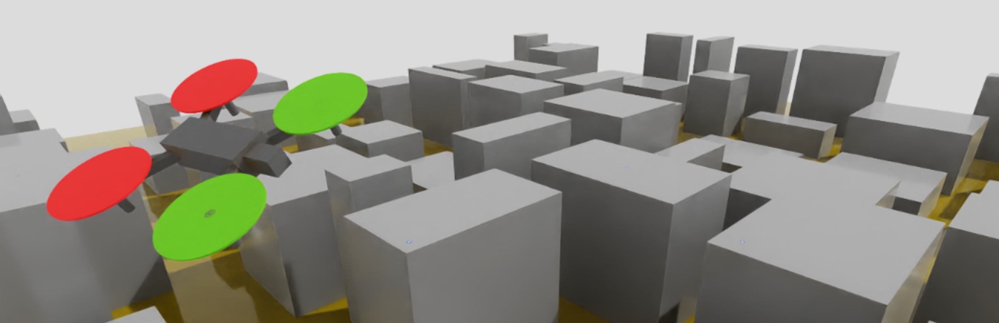
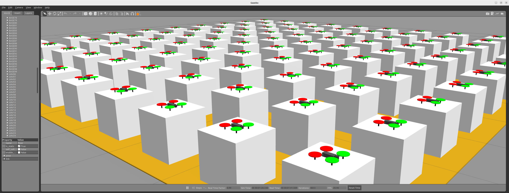
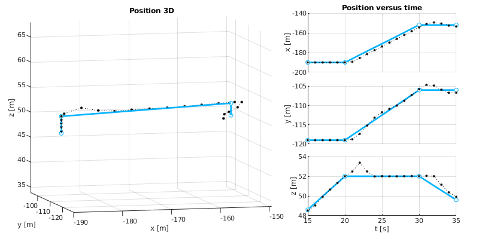

# NavSim

Update 06/10/2024

NAVSIM is a **U-Space** service development tool. It provides:

- Real-time simulation of 3D urban airspace (executed in NVIDIA Isaac Sim).

- A comprehensive set of tools (developed in Python) to:

  - Define **drone operators** capable of generating flight operation needs.
  - Generate **flight plans** for the execution of these operations.
  - Detect and resolve conflicts between flight plans.
  - Deploy **UAVs** in the scenario capable of executing a flight plan provided by their operator.
    
 

  - Monitor the execution of flight plans.
    

## Resources

- [Installation](./doc/install/install.md)
- [Tutorial 1:](./doc/tuto1/tuto1.md) Running your first simulation with Matlab connection
- [Tutorial 2:](./doc/tuto2/tuto2.md) Running 100 drones
- [Tutorial 3:](./doc/tuto3/tuto3.md) Executing flight plans based on straight segments
- [Tutorial 4:](./doc/tuto4/tuto4.md) Executing smoothed flight plans
- [Tutorial 5:](./doc/tuto5/tuto5.md) Generation of a fleet of autonomous drones operating in the city
