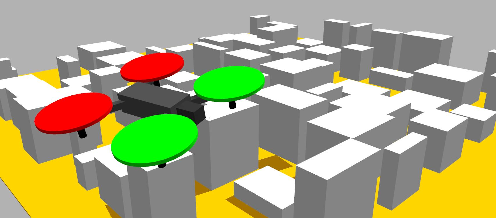

# NavSim

Update 15/01/2024.

NAVSIM is a **U-Space** service development tool. It provides:

- Real-time simulation of 3D urban airspace (executed in the Gazebo 11 _Classic_ environment).

- Communication support between different services (implemented in ROS2).

- A comprehensive set of tools (developed in Matlab® R2023b) to:

  - Define **drone operators** capable of generating flight operation needs.
  - Generate **flight plans** for the execution of these operations.
  - Detect and resolve conflicts between flight plans.
  - Deploy **UAVs** in the scenario capable of executing a flight plan provided by their operator.
  - Monitor the execution of flight plans.

