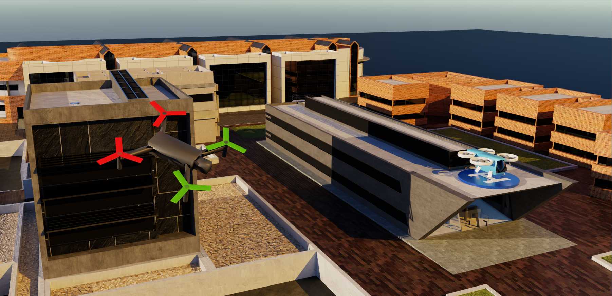
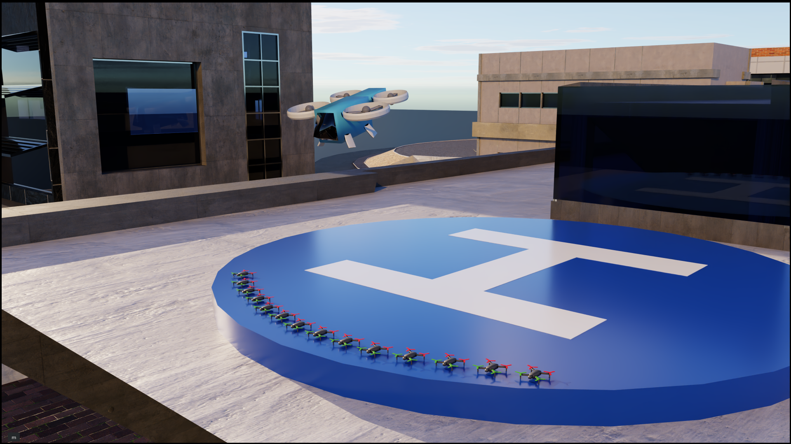
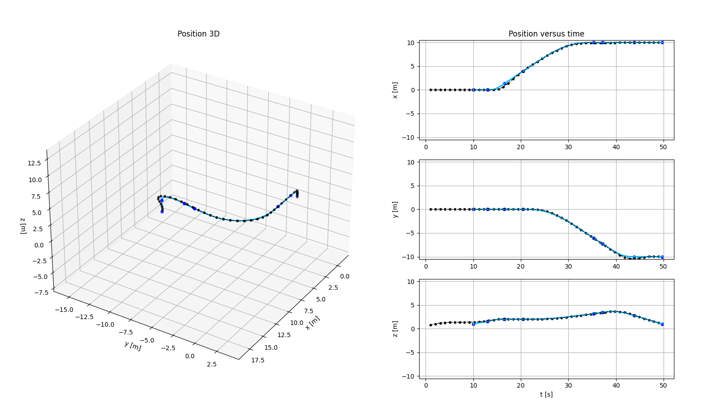

# NavSim

Update 22/11/2024

NAVSIM is a **U-Space** service development tool. It provides:

- Real-time simulation of 3D urban airspace (executed in NVIDIA Isaac Sim).

- A comprehensive set of tools (developed in Python) to:

  - Define **drone operators** capable of generating flight operation needs.
  - Generate **flight plans** for the execution of these operations.
  - Detect and resolve conflicts between flight plans.
  - Deploy **UAVs** in the scenario capable of executing a flight plan provided by their operator.
    
 

  - Monitor the execution of flight plans.
    

## Resources

- [Installation](./doc/install/install.md)
- [Tutorial 1:](./doc/manual_controller_tuto/manual_controller_tuto.md) Controlling an UAV via joystick
- [Tutorial 2:](./doc/command_generator_tuto/command_generator_tuto.md) Controlling an UAV via commands
- [Tutorial 3:](./doc/flight_plan_generator_tuto/flight_plan_generator_tuto.md) Executing a Flight Plan
