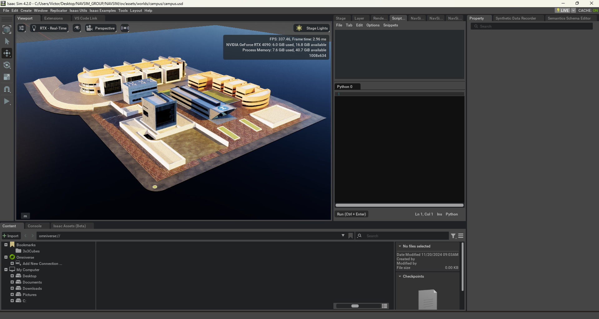
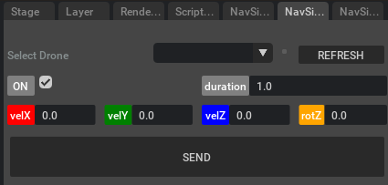

# 02: Controlling an UAV via commands

In this tutorial you will learn how to send commands to an UAV to control its movement.

## Launch Isaac Sim

First, open the simulation environment NVIDIA Isaac Sim. Once opened, it will offer a similar aspect as the following
picture (the panels' location may differ depending on the personal configuration):


## Launch the scenario

In the *Content* panel, find the file `navsim/ov/assets/worlds/campus/campus.usd` and doble click on it.
It will open a scenario where our campus is detailed.



Under *Stage* panel, find `World/Vertiports/minidrone_vertiport` prim (a prim is how models are called in USD), select 
it and press *F* key to focus (make zoom) on it.
Then drag and drop the file `navsim/ov/fleet/UAM_minidrone/UAM_minidrone.usd` over the vertiport. It will appear a 
quadcopter in the scene. You can elevate it a bit and click on *PLAY* button to start the
simulation. You will see that the UAV falls. Besides, you can have a look at its internal components under the *Stage*
panel.

https://github.com/user-attachments/assets/68807db9-35ee-4cd5-9f48-3e62e3f2b44c

## Send a Command

For this tutorial we need to work with our own extension named *NavSim - Command Generator*. This extension has two
main parts, the first one is in charge of selecting a UAV from the scene to send the command to, and the second one is
the set of parameters from the command to be modified. Finally, at the end of the extensions there is a *SEND* button to 
submit the Command.



The parameters are:
- ON: It is a checkbox to indicate whether to turn on the rotors or not
- duration: It is a positive float field to tell the UAV during how many seconds you want the command to be executed
- velX: linear velocity along X axis in m/s (forward)
- velY: linear velocity along Y axis in m/s (sidewards)
- velZ: linear velocity along Z axis in m/s (up-down)
- rotZ. angular velocity in rad/s

To send a command, first click on *REFRESH* button to repopulate the UAVs selector dropdown and choose one among the
options. Afterwards, set the *duration* parameter to 2 and the *velZ* to 1. Finally start the simulation by clicking
on the *PLAY* button, zoom out a bit to see how the UAV raises, and then click on *SEND* button to remit the command. 
You will see that the drone elevates 2 meters high, 1 meter per second during 2 seconds.

https://github.com/user-attachments/assets/90c780dd-71e7-4563-924a-ae71366c553e

## Python implementation

If what you want is to be able to send commands using just code, we have a little example to show you how.
First open the `Window/Script Editor` panel and paste in the *Python 0* tab the following code:

```bash
# Import necessary modules
from omni.isaac.core.utils.stage import get_current_stage
import carb.events
from uspace.flight_plan.command import Command
import pickle
import base64
import omni.kit.app as app

# Get the current stage
stage = get_current_stage()
# Get the recently added drone
uav = stage.GetPrimAtPath("/UAM_minidrone")
# Get its associated event
uav_event = carb.events.type_from_string("NavSim." + str(uav.GetPath()))

# Build the command
command = Command(
    on = True,
    velX = 1,
    velY = 0,
    velZ = 0,
    rotZ = 1.57,
    duration = 4
)

# Serialize the command
serialized_cmd = base64.b64encode(pickle.dumps(command)).decode("utf-8")

# Get the bus event stream
bus_event_stream = app.get_app_interface().get_message_bus_event_stream()
# Send the command
bus_event_stream.push(uav_event, payload={"method": "eventFn_RemoteCommand",
                                          "command": serialized_cmd})
```

Finally begin the simulation by clicking on *PLAY* button and then click on *Run (Ctrl + Enter)* button to run the
script. You will see how the UAV does a 360º lap.
