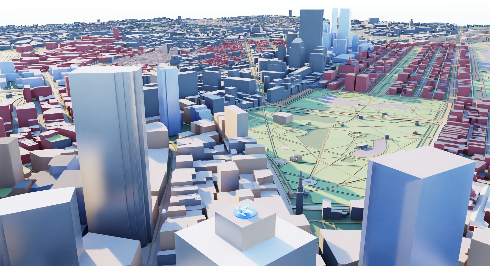
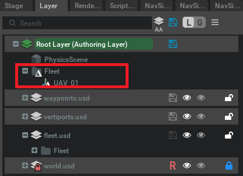
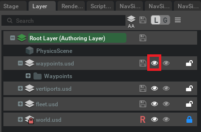
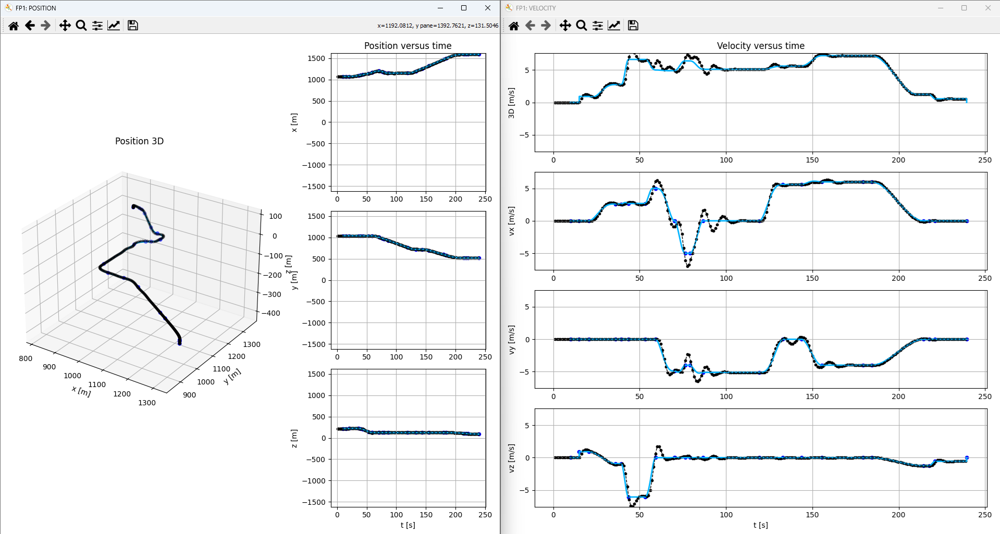

# 03: Executing a Flight Plan

In this tutorial you will learn how to create a flight plan using code, and assign it to a drone.

## Launch Isaac Sim

First, open the simulation environment NVIDIA Isaac Sim. Once opened, it will offer a similar aspect as the following
picture (the panels' location may differ depending on the personal configuration):


## Launch the scenario

In the *Content* panel, find the file `navsim/ov/sims/boston/main.usd` and doble click on it.You will see a low poly representation of Boston city.



If you have a look at the *stage* panel you can see that the scene is already set, there is an aerotaxi and two
vertiports well positioned, as well as  three different cameras to follow the aerotaxi along its flight plan. You can
switch between these cameras by clicking on the *camera* icon at the top of the *viewport*.


The scene is built using layers as in Photoshop (have a look at *Layer* panel), which allows us to easily make changes and work simultaneously. When you modify a layer that is not the *authoring* one it will create a *delta*, which is a temporal change in the scene, that is, you can delete it and the scenary will be reseted to its initial state.



## Build a Flight Plan
Let's now build the flight plan by code!  

First, we import the necessary modules and locate the UAV as well as its associated event.

```bash
# Import necessary modules
from omni.isaac.core.utils.stage import get_current_stage
import carb.events
from uspace.flight_plan.flight_plan import FlightPlan
import pickle
import base64
import omni.kit.app as app

# Get the current stage
stage = get_current_stage()
# Get the recently added drone
uav = stage.GetPrimAtPath("/Fleet/UAV_01")
# Get its associated event
uav_event = carb.events.type_from_string("NavSim." + str(uav.GetPath()))
```

Then, we create the waypoints the plan is based on.

```bash
# Create the FlightPlan
fp = FlightPlan()
# Build the waypoints
fp.set_waypoint(label="wp0", time=0, pos=[1071.0, 1039.0, 216.1])
fp.set_waypoint(label="wp0_P", time=5, pos=[1071.0, 1039.0, 216.1])
fp.set_waypoint(label="wp1", time=20, pos=[1071.0, 1039.0, 230.0])
fp.set_waypoint(label="wp2", time=35, pos=[1110.0, 1039.0, 216.1])
fp.set_waypoint(label="wp3", time=50, pos=[1150.0, 1039.0, 125.0])
fp.set_waypoint(label="wp4", time=60, pos=[1200.0, 1039.0, 125.0])
fp.set_waypoint(label="wp5", time=70, pos=[1200.0, 990.0, 125.0])
fp.set_waypoint(label="wp6", time=80, pos=[1150.0, 950.0, 125.0])
fp.set_waypoint(label="wp7", time=125, pos=[1150.0, 720.0, 125.0])
fp.set_waypoint(label="wp8", time=150, pos=[1290.0, 720.0, 125.0])
fp.set_waypoint(label="wp9", time=180, pos=[1470.0, 600.0, 125])
fp.set_waypoint(label="wp10", time=200, pos=[1590.0, 520.0, 125.0])
fp.set_waypoint(label="wp11", time=220, pos=[1590.0, 520.0, 100])
fp.set_waypoint(label="wp12", time=240, pos=[1590.0, 520.0, 88.7])
```

Afterwards, we connect the waypoints by computing the direct linear velocity between each one.

```bash
# Set linear uniform velocities
fp.set_uniform_velocity()
```

At this point we could run the simulation and the UAV would follow the route. Nevertheless, we will have a better
result if we smooth the flight plan, that is, use a curve instead of a direct connexion.

```bash
# Smooth some corners of the flight plan
fp.smooth_waypoint_speed("wp1", 0.15)
fp.smooth_waypoint_speed("wp2", 0.2)
fp.smooth_waypoint_speed("wp3", 0.2)
fp.smooth_waypoint_speed("wp4", 0.15)
fp.smooth_waypoint_speed("wp5", 0.15)
fp.smooth_waypoint_speed("wp6", 0.12)
fp.smooth_waypoint_speed("wp7", 0.12)
fp.smooth_waypoint_speed("wp8", 0.05)
fp.smooth_waypoint_duration("wp9", 0.05, 0.2)
fp.smooth_waypoint_duration("wp10", 0.1, 0.2)
fp.smooth_waypoint_duration("wp11", 0.1, 0.2)
```

Finally, we postpone the flightplan 10 seconds and send it to the drone.

```bash
# Postpone 10 seconds the flightplan
fp.postpone(10)

# Serialize the flightplan
serialized_fp = base64.b64encode(pickle.dumps(fp)).decode("utf-8")

# Get the bus event stream
bus_event_stream = app.get_app_interface().get_message_bus_event_stream()
# Send the flightplan
bus_event_stream.push(uav_event, payload={"method": "eventFn_FlightPlan",
                                                "fp": serialized_fp})
```

Here you have the complete code:

```bash
# Import necessary modules
from omni.isaac.core.utils.stage import get_current_stage
import carb.events
from uspace.flight_plan.flight_plan import FlightPlan
import pickle
import base64
import omni.kit.app as app

# Get the current stage
stage = get_current_stage()
# Get the recently added drone
uav = stage.GetPrimAtPath("/Fleet/UAV_01")
# Get its associated event
uav_event = carb.events.type_from_string("NavSim." + str(uav.GetPath()))

# Create the FlightPlan
fp = FlightPlan()
# Build the waypoints
fp.set_waypoint(label="wp0", time=0, pos=[1071.0, 1039.0, 216.1])
fp.set_waypoint(label="wp0_P", time=5, pos=[1071.0, 1039.0, 216.1])
fp.set_waypoint(label="wp1", time=20, pos=[1071.0, 1039.0, 230.0])
fp.set_waypoint(label="wp2", time=35, pos=[1110.0, 1039.0, 216.1])
fp.set_waypoint(label="wp3", time=50, pos=[1150.0, 1039.0, 125.0])
fp.set_waypoint(label="wp4", time=60, pos=[1200.0, 1039.0, 125.0])
fp.set_waypoint(label="wp5", time=70, pos=[1200.0, 990.0, 125.0])
fp.set_waypoint(label="wp6", time=80, pos=[1150.0, 950.0, 125.0])
fp.set_waypoint(label="wp7", time=125, pos=[1150.0, 720.0, 125.0])
fp.set_waypoint(label="wp8", time=150, pos=[1290.0, 720.0, 125.0])
fp.set_waypoint(label="wp9", time=180, pos=[1470.0, 600.0, 125])
fp.set_waypoint(label="wp10", time=200, pos=[1590.0, 520.0, 125.0])
fp.set_waypoint(label="wp11", time=220, pos=[1590.0, 520.0, 100])
fp.set_waypoint(label="wp12", time=240, pos=[1590.0, 520.0, 88.7])
# Set linear uniform velocities
fp.set_uniform_velocity()
# Smooth some corners of the flight plan
fp.smooth_waypoint_speed("wp1", 0.15)
fp.smooth_waypoint_speed("wp2", 0.2)
fp.smooth_waypoint_speed("wp3", 0.2)
fp.smooth_waypoint_speed("wp4", 0.15)
fp.smooth_waypoint_speed("wp5", 0.15)
fp.smooth_waypoint_speed("wp6", 0.12)
fp.smooth_waypoint_speed("wp7", 0.12)
fp.smooth_waypoint_speed("wp8", 0.05)
fp.smooth_waypoint_duration("wp9", 0.05, 0.2)
fp.smooth_waypoint_duration("wp10", 0.1, 0.2)
fp.smooth_waypoint_duration("wp11", 0.1, 0.2)

# Postpone 10 seconds the flightplan
fp.postpone(10)

# Serialize the flightplan
serialized_fp = base64.b64encode(pickle.dumps(fp)).decode("utf-8")

# Get the bus event stream
bus_event_stream = app.get_app_interface().get_message_bus_event_stream()
# Send the flightplan
bus_event_stream.push(uav_event, payload={"method": "eventFn_FlightPlan",
                                                "fp": serialized_fp})
```

This code builds a flightplan based on some waypoints which you can see in the scene so that we can have a hint about
which is the direction the UAV must follow. You can hide/show these objects by clicking on the *eye* icon on the
*waypoints.usd* layer under the *Layer* panel



Lastly, open the `Window/Script Editor` and the paste the whole code within the *Python 0* tab. Then, begin the simulation by clicking on *PLAY* button and on *Run (Ctrl + Enter)* button aftwerwards to run the
script.  

NOTE: It is important to run the script as soon as the simulation starts, because if simulation time gets greater than
the initial flightplan time slot, which is 10s (once postponed), then the flighplan will be discarded as it cannot be
executed. This is solved by postponing the flighplan the current simulation time plus some extra seconds. However, we 
did not do this in the example for code simplicity.  

When the UAV finishes, you can see how well it followed the route with the statistics:



https://github.com/user-attachments/assets/3854de7c-7dd4-4df0-a664-5af846bcc93b

