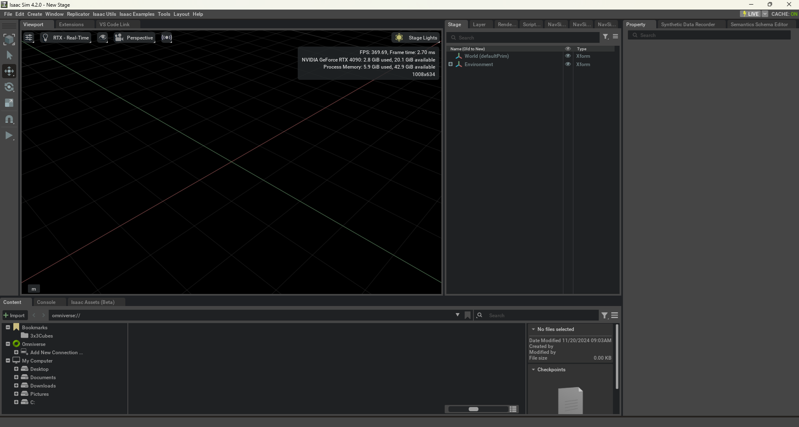
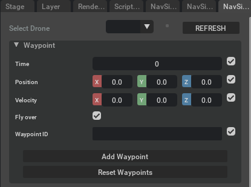
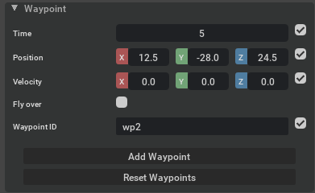
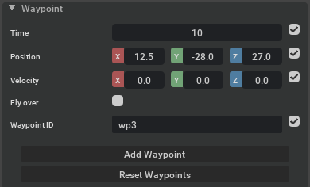
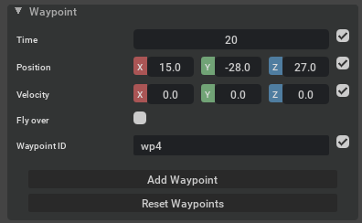
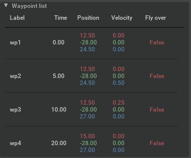
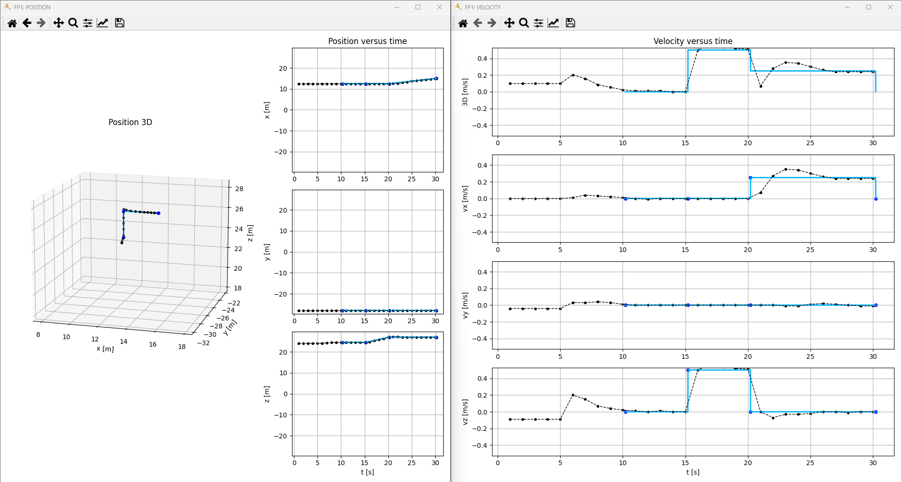
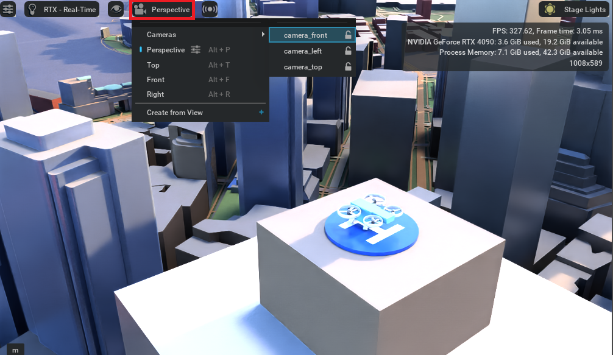

# 03: Executing a Flight Plan

In this tutorial you will learn how to create a flight plan and assign it to a drone.

## Launch Isaac Sim

First, open the simulation environment NVIDIA Isaac Sim. Once opened, it will offer a similar aspect as the following
picture (the panels' location may differ depending on the personal configuration):



## Launch the scenario

In the *Content* panel, find the file `navsim/ov/assets/worlds/campus/campus.usd` and doble click on it.
It will open a scenario where our campus is detailed.


Under *Stage* panel, find `World/Vertiports/minidrone_vertiport` prim (a prim is how models are called in USD), select 
it and press *F* key to focus (make zoom) on it.
Then drag and drop the file `navsim/ov/fleet/UAM_minidrone/UAM_minidrone.usd` over the vertiport. It will appear a 
quadcopter in the scene. You can elevate it a bit and click on *PLAY* button to start the
simulation. You will see that the UAV falls. Besides, you can have a look at its internal components under the *Stage*
panel.

https://github.com/user-attachments/assets/68807db9-35ee-4cd5-9f48-3e62e3f2b44c

## Build a Flight Plan

Before beginning with the tutorial, you need to know that our flight plan is based on *waypoints*. These waypoints
contain information about the position and velocity the UAV must have at a specific time slot, so in order to build a
flight plan you must create a set of waypoints which will be ordered in time and then interconnected.  

For this task we have developed our own custom extension named *NavSim - Flight Plan Generator*. This extension allows
you to build a flight plan using UI, no need to use code.
It is divided into three different parts, the drone selector, to choose the UAV to send flight plan to, the waypoint
builder and the generated waypoint list.  

In regards to the waypoint builder, it has the following parameters:
- Time: time slot in which the waypoint will be inserted
- Position: the position of the waypoint in a 3D space
- Velocity: the linear velocity to reach next waypoint
- Fly over: wheter this waypoint is mandatory to pass trough or not
- WaypointID: an identifier of the waypoint



Each parameter has a checkbox on its right, this is intended to tell the extension whether to have into account the
parameter or not. If not, the extension will set the corresponding values automatically.  

Finally there are two buttons, one to add the waypoint, and another to clean the waypoint list.  

Once you know how the extension works, let's give it a try. Locate the extension and create the waypoints below.  

Waypoint 1


Waypoint 2



Waypoint 3



Waypoint 4



Once all waypoints have been added, the resulting waypoint list should be as follows:



Finally, click on *REFRESH* button at the top of the extension, select an UAV among the options, click on *PLAY*
button to start the simulation and click on *Send Flight Plan* at the bottom of the extension to submit the flight plan.

https://github.com/user-attachments/assets/38b11870-94a4-4309-9640-19287bd6b189

When the drone finishes the flight plan, two new windows will pop up. In those figures you will see two different lines,
one blue continuous line (flight plan) and another black dotted line (UAV). The first figure shows the position in the
3D space as well as the position versus time. On the other hand, the second figure shows the velocity versus time.  
Thanks to this we can have an idea of how well the drone followed the plan.



## Python implementation

Let's try to build a bigger flight plan with a bigger UAV in a bigger city!  

Open the file `navsim/ov/assets/worlds/bostom_city/bostom_city.usd`. You will see a low poly representation of Bostom
city. If you have a look at the *stage* panel you can see that the scene is already set, there is an aerotaxi and two
vertiports well positioned, as well as  three different cameras to follow the aerotaxi along its flight plan. You can
switch between these cameras by clicking on the *camera* icon at the top of the *viewport*.



Afterwards, open the `Window/Script Editor` panel and paste in the *Python 0* tab the following code:

```bash
# Import necessary modules
from omni.isaac.core.utils.stage import get_current_stage
import carb.events
from uspace.flight_plan.flight_plan import FlightPlan
import pickle
import base64
import omni.kit.app as app

# Get the current stage
stage = get_current_stage()
# Get the recently added drone
uav = stage.GetPrimAtPath("/UAM_aerotaxi")
# Get its associated event
uav_event = carb.events.type_from_string("NavSim." + str(uav.GetPath()))

# Create the FlightPlan
fp = FlightPlan()
# Build the waypoints
fp.set_waypoint(label="wp0", time=0, pos=[1071.0, 1039.0, 216.1])
fp.set_waypoint(label="wp0_P", time=5, pos=[1071.0, 1039.0, 216.1])
fp.set_waypoint(label="wp1", time=20, pos=[1071.0, 1039.0, 230.0])
fp.set_waypoint(label="wp2", time=35, pos=[1110.0, 1039.0, 216.1])
fp.set_waypoint(label="wp3", time=50, pos=[1150.0, 1039.0, 125.0])
fp.set_waypoint(label="wp4", time=60, pos=[1200.0, 1039.0, 125.0])
fp.set_waypoint(label="wp5", time=70, pos=[1200.0, 990.0, 125.0])
fp.set_waypoint(label="wp6", time=80, pos=[1150.0, 950.0, 125.0])
fp.set_waypoint(label="wp7", time=125, pos=[1150.0, 720.0, 125.0])
fp.set_waypoint(label="wp8", time=150, pos=[1290.0, 720.0, 125.0])
fp.set_waypoint(label="wp9", time=180, pos=[1470.0, 600.0, 125])
fp.set_waypoint(label="wp10", time=200, pos=[1590.0, 520.0, 125.0])
fp.set_waypoint(label="wp11", time=220, pos=[1590.0, 520.0, 100])
fp.set_waypoint(label="wp12", time=240, pos=[1590.0, 520.0, 88.7])
# Set linear uniform velocities
fp.set_uniform_velocity()
# Smooth some corners of the flight plan
fp.smooth_waypoint_speed("wp1", 0.15)
fp.smooth_waypoint_speed("wp2", 0.2)
fp.smooth_waypoint_speed("wp3", 0.2)
fp.smooth_waypoint_speed("wp4", 0.15)
fp.smooth_waypoint_speed("wp5", 0.15)
fp.smooth_waypoint_speed("wp6", 0.12)
fp.smooth_waypoint_speed("wp7", 0.12)
fp.smooth_waypoint_speed("wp8", 0.05)
fp.smooth_waypoint_duration("wp9", 0.05, 0.2)
fp.smooth_waypoint_duration("wp10", 0.1, 0.2)
fp.smooth_waypoint_duration("wp11", 0.1, 0.2)

# Postpone 10 seconds the flightplan
fp.postpone(10)

# Serialize the flightplan
serialized_fp = base64.b64encode(pickle.dumps(fp)).decode("utf-8")

# Get the bus event stream
bus_event_stream = app.get_app_interface().get_message_bus_event_stream()
# Send the flightplan
bus_event_stream.push(uav_event, payload={"method": "eventFn_FlightPlan",
                                                "fp": serialized_fp})
```

Finally begin the simulation by clicking on *PLAY* button and then click on *Run (Ctrl + Enter)* button to run the
script.  

NOTE: It is important to run the script as soon as the simulation starts, because if simulation time gets greater than
the initial flightplan time slot, which is 10s (once postponed), then the flighplan will be discarded as it cannot be
executed. This is solved by postponing the flighplan the current simulation time plus some extra seconds. However, we 
did not do this in the example for code simplicity.

https://github.com/user-attachments/assets/84cf7dde-e62b-437e-80ac-eec80e55bac3
