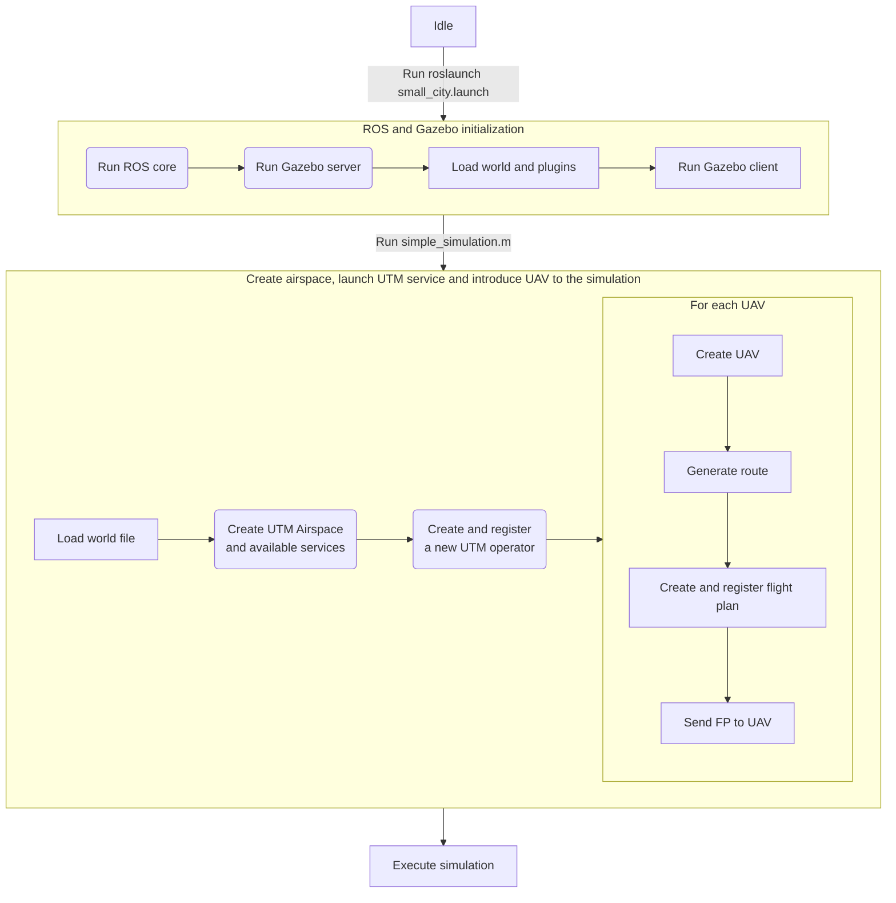

# Installation


## Set up your machine

You can install NAVSIM on either a real computer or a virtual machine. In the second case, we have successfully tested it with VMware Workstation Player 17. You can obtain it [here](https://www.vmware.com/es/products/workstation-player/workstation-player-evaluation.html).

Configure a computer with **Ubuntu 22.04.3 LTS (Jammy Jellyfish)**. You can obtain a Desktop Image [here](https://releases.ubuntu.com/jammy/). Install the system and update everything.

>:warning: NAVSIM has been developed and tested in the specified Ubuntu version. While it might work in other versions, there are no compatibility guarantees.

> You can install ROS/Gazebo and MATLAB on the same computer. However, running MATLAB on a different computer, including Windows platforms, may be beneficial in the case of extensive simulations where the resources of typical machines may be insufficient. In such scenarios, make sure that the computers are connected to the same network and can communicate with each other.


## Install ROS2

NAVSIM runs on **ROS2** (Robot Operating System) **Humble Hawksbill LTS**. 
Please follow the official [tutorial](https://docs.ros.org/en/humble/Installation/Ubuntu-Install-Debians.html).


Make sure that:
- A _full desktop_ installation is performed.
- The necessary dependencies for building packages are installed.
- Source ROS2
```bash
source /opt/ros/humble/setup.bash
echo "source /opt/ros/humble/setup.bash" >> ~/.bashrc
```
Verify the installation with the `ros2` command.


As a part of _ROS Noetic_, the _Gazebo 11_ simulator will be installed. To check it, execute the command `gazebo` in a terminal. The graphical interface of Gazebo should open:


>:warning: U-TRAFMAN has been developed and tested in the specified ROS/Gazebo versions. While it might work in other versions, there are no compatibility guarantees.


## Install Python

Later, MATLAB ROS Toolbox will require Python.

In Ubuntu, it is required Python version 3.9.x. 
You may install it by executing the following commands in a terminal:
```bash
sudo apt install python3.9-venv
mkdir /tmp/venv
```

In Windows, it is required Python version 3.9.x or 3.10.x. 
For example, you may download and install Python 3.10.11 from the [official site](https://www.python.org/ftp/python/3.10.11/python-3.10.11-amd64.exe).


>:warning:️ U-TRAFMAN simulator has been tested with the mentioned versions of Python. While it may work with other versions, there are no compatibility guarantees.


## Install and configure MATLAB

U-TRAFMAN provides a variety of tools for launching and analyzing simulations. These tools are programmed in MATLAB®. To install it, you can follow these steps:


1. Download MATLAB R2023b from the official [MathWorks website](https://es.mathworks.com/downloads).

   >:warning:  U-TRAFMAN simulator has been tested in **MATLAB R2023a** and **MATLAB R2023b**. While it might work in other versions, there are no compatibility guarantees.

2. In Ubuntu, unzip the installer package by running the following commands in your terminal:
```bash
unzip matlab_R2023b_glnxa64.zip -d matlabinstaller
cd matlabinstaller
```
3. In Windows, execute the installer. In Ubuntu, execute the installation script with root privileges:
```bash
sudo ./install
```
4. Follow the installation process:

   a) Select your license and user information.
   
   b) Choose the destination folder (the default location is fine).

   c) Select the MATLAB products you want to install. Ensure that you select at least the following components:
      - MATLAB R2023b
      - Parallel Computing Toolbox
      - ROS Toolbox

   d) Configure installation options:
      - Set _Create symbolic links to MATLAB scripts in:_ `/usr/local/bin`
      - Choose _Improve MATLAB startup performance_ based on your preferences.

   e) Confirm your selections and continue the installation process.

5. Once MATLAB is installed, you can delete the installation file and the `matlabinstaller` folder.

6. Open MATLAB. In Windows, start the application. In Ubuntu, execute `matlab` in a terminal.

    >If Matlab indicates a new release is available and prompts you to update, click on "Don't Show Again."

7. Select **HOME > ENVIRONMENT tile > Preferences**. In the panel on the left, select **ROS Toolbox**. Click on **Open ROS Toolbox Preferences**.

8. In the **ROS Toolbox Preferences** dialog box, set the path to your Python installation.
Typical values may be:


   | OS      | Python path |
   |:--------|:------------|
   | Ubuntu  | /usr/bin/python3.9 |
   | Windows | C:\Users\User\AppData\Local\Programs\Python\Python310\pythonw.exe |


10. Click on **Recreate Python Environment**. When it finishes, press **OK**.


## Install and configure U-TRAFMAN

### Clone U-TRAFMAN package

You can download U-TRAFMAN by cloning the repository in your ROS installation:
```bash
cd /opt/ros/noetic/share
sudo git clone https://github.com/I3A-NavSys/utrafman_sim
```

After that, change the permissions of the `utrafman_sim` folder to your user executing the following commands (replace `username` with your actual _username_ and `groupname` with your actual _groupname_):
```bash
sudo chown -R username:groupname utrafman_sim
```


### Compiling ROS messages with MATLAB

To compile custom ROS messages, perform the following steps:

1. Open MATLAB.

2. Go to the folder `utrafman_sim/src/matlab/tools/` (the complete path in Ubuntu should be `/opt/ros/noetic/share/utrafman_sim/src/matlab/tools/`).

3. Edit the script `UTRAFMAN_init.m`. If you are working with several machines, you may set these values according to the user or machine names:

   - Set variable **ROS_MASTER_IP** with the IP of your machine.

     If you run ROS/Gazebo and MATLAB on the same computer, you can set it to either `localhost` or `127.0.0.1`. If you use a two-computer setup, set the actual IP address of the computer where ROS/Gazebo is running.
     >You can obtain your IP number by employing the command `ifconfig`.

     >You can find more information about how to configure MATLAB ROS_MASTER IP address in Matlab [here](https://es.mathworks.com/help/ros/ug/get-started-with-ros.html).
 
   - Set variable **UTRAFMAN_DIR** with the folder path where your simulation installation resides.
     
     >Default value will be `/opt/ros/noetic/share/utrafman_sim/src/`. Change this variable if U-TRAFMAN installation is in another directory or when using a different OS.

4. Run the script `ros_custom_message_compiler_MATLAB.m`. It may take several minutes. If everything is correct, you should see a message in the MATLAB console saying `Build succeeded`.

You can find more information about how to compile custom ROS messages [here](https://es.mathworks.com/help/ros/custom-message-support.html?s_tid=CRUX_lftnav). 


### Compile U-TRAFMAN simulator

We need to compile a ROS (Catkin) workspace containing the simulation environment:
```bash
cd /opt/ros/noetic/share/utrafman_sim/src/gazebo-ros
mkdir -p /devel/include && cp -r src/matlab_msg_gen_ros1/glnxa64/install/include/utrafman devel/include/
catkin_make
```

<!--
>:warning: If `catkin_make` does not work properly, execute this code:
```bash
cp -r src/matlab_msg_gen_ros1/glnxa64/install/include/utrafman devel/include/
catkin_make
```
-->

After that, source the compiled workspace into your `.bashrc` file (in your home directory) for it to be accessible:
```bash
echo "source /opt/ros/noetic/share/utrafman_sim/src/gazebo-ros/devel/setup.bash" >> ~/.bashrc
source ~/.bashrc
```


## Running your first simulation

### Base simulation

U-TRAFMAN includes a basic simulation to help you verify if everything is functioning correctly. To get started, **open a new terminal** (don't use the same where you did the compilation) and execute the following command:

```bash
roslaunch utrafman generated_city.launch
```
You should observe ROS being launched in the terminal and Gazebo opening in a new window. In the Gazebo window, you should see a world with simple buildings.

>:warning: If you are running Gazebo within a virtual machine, the scenario may not be fully rendered as you are not utilizing your computer's 3D graphics card.


In a new terminal, check the ROS services responsible for managing drones in Gazebo:
```bash
rosservice list /godservice/
```
The following services should be running. In other case, it means that there was a problem during the compilation phase:
   - _/godservice/insert_model_
   - _/godservice/remove_model_
   - _/godservice/transport_model_


Next, let's go to generate some UAVs into the world and send flight plans to them:

1. Open MATLAB and navigate to the folder **.../utrafman_sim/src/matlab/simulations/**.
2. Run the script **simple_simulation.m**. This will set up your simulation environment with 2 UAVs following their respective flight plans (a random route of 500 meters).
3. In Gazebo, open the left panel and select **World > Models**. At the end of the list, you can find several drones. Right-click one of them and configure the camera to **Follow** it.


Each time a random route is generated for a UAV, the script will display it in a 3D visualization, depicting both the flight path and the buildings within the virtual environment. This visualization can aid in comprehending the trajectory that each UAV will follow during the simulation.


Once the simulation is completed, you can access a **SimulationProcessor** object in the MATLAB workspace, referenced by the variable `SP`. 
This object enables you to retrieve and analyze simulation data of a specific flight plan. 
For example, if you wish to visualize the telemetry data of _flight plan 1_, you can execute the following command in MATLAB:

```matlab
SP.telemetryViewer(1);
```


### Simulation lifecycle

After running a simulation, you should understand how the simulation lifecycle works. The following chart shows the lifecycle of a simulation: (**try reloading the page (F5) if not shown).**

The simulation lifecycle is divided into two phases:
1. **ROS and Gazebo initialization**: ROS and Gazebo are initialized in this phase. ROS core and Gazebo server are launched, and the world file is loaded. Finally, Gazebo client is initialized and connected to the server. This phase is executed when you run the `roslaunch` command.
2. **Create airspace, launch UTM service, and introduce UAV to the simulation**: In this phase, the UTM Airspace is created, and the UTM services are established. Then, a new operator is set and registered in the UTM Airspace. Finally, a new instance is initialized for each UAV, a random route is generated, a new flight plan is created and registered in the UTM Airspace, and the flight plan is sent to the UAV. **Note that this is usually the main sequence, but you can create and register operators, UAVs, and flight plans anytime during the simulation.**. This phase is executed when you run the `simple_simulation.m` script.
