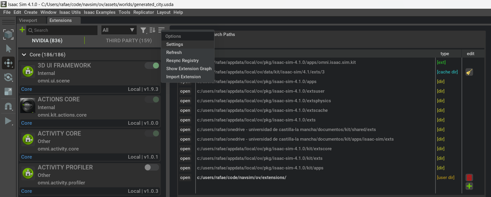

# Installation

## Set up your machine


we recommend to install NAVSIM over a Windows 11 machine.


## Install NVIDIA Omniverse

Actualmente, NavSim está soportado sobre *Nvidia Isaac Sim 4.1.0*. Este framework requiere como mínimo:
- CPU Intel Core i7 (7th Generation) / AMD Ryzen 5
- Memoria RAM de 32GB
- Disco duro de 50GB SSD
- VRAM 8GB
- GPU NVIDIA RTX


## Install Python

A diferencia de las versiones anteriores, NavSim 2.0 is developed in Python 3.10.x.
In Windows, you may download and install Python 3.10.11 from the [official site](https://www.python.org/ftp/python/3.10.11/python-3.10.11-amd64.exe).


## Install Git

```bash
sudo apt update
sudo apt install git
git --version
```

Optionally, install GitHub Desktop from:
https://docs.github.com/en/desktop/installing-and-authenticating-to-github-desktop/installing-github-desktop


## Clone NAVSIM repository

You can download NAVSIM by cloning the repository in your computer:
```bash
cd
mkdir code
cd code
sudo git clone https://github.com/I3A-NavSys/navsim
```

## Load NAVSIM extensions
Open the extensions window from top menu `Window/Extensions`


Open the the settings `Options/Setting`,
find in your local storage the path to `navsim/ov/extensions` and add it to *Extension Search Paths*.



Then, select *THIRD PARTY* tab and *User* dropdown.
There you will find our own extensions from NavSim.
Enable the extensions *NAVSIM - COMMAND GENERATOR* (you can set the extension to autoload when launching the app).
See how a new window appears with the extension's content.
Move and adjust the window to you pleasure.


## Running your first simulation 

Now, you are prepared to go to the 
[first tutorial](https://github.com/I3A-NavSys/navsim/blob/main/doc/tuto1/tuto1.md)
to execute a simulation.
