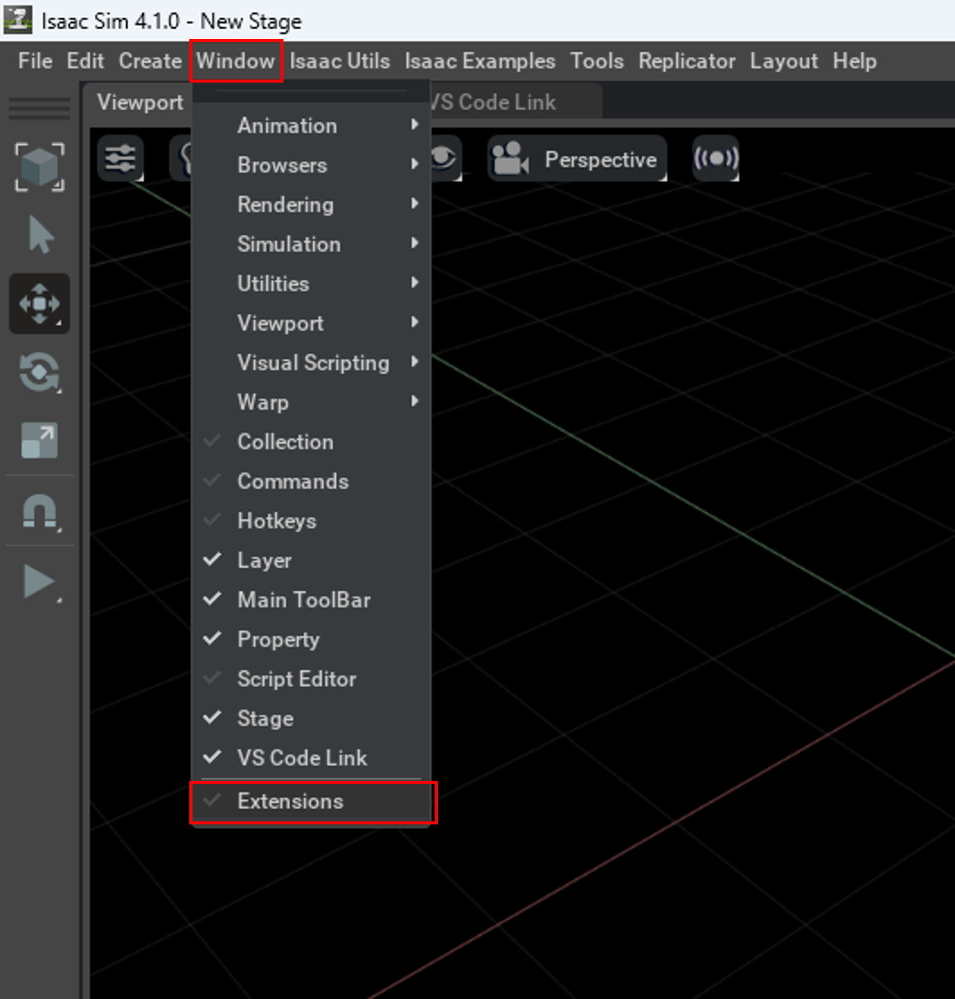
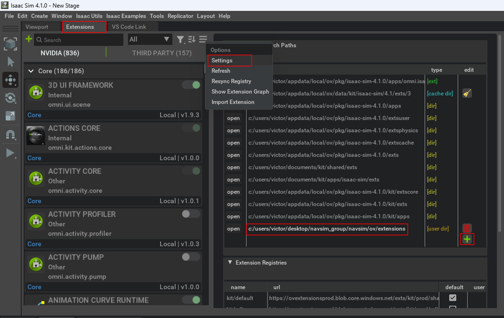
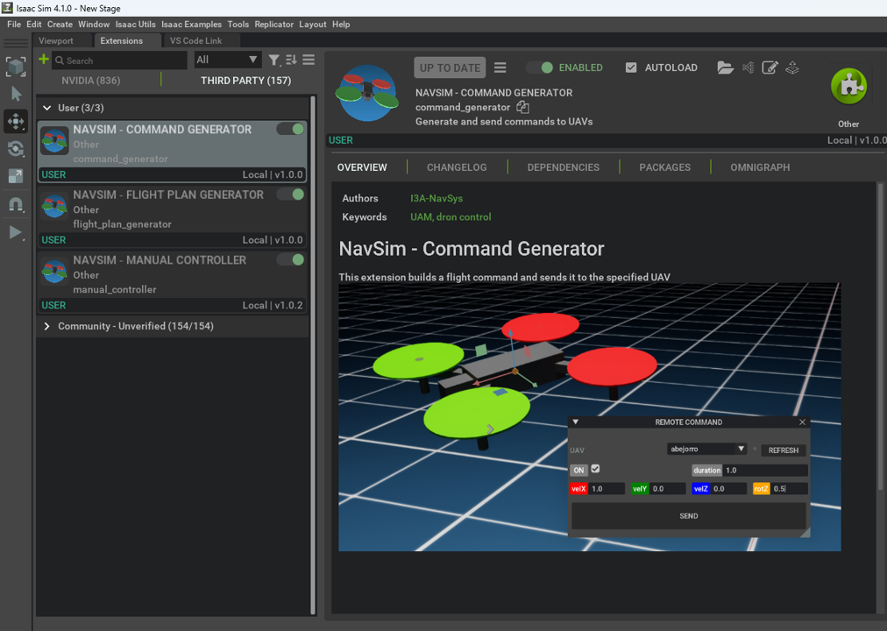

# Installation

## Set up your machine


we recommend to install NAVSIM over a Windows 11 machine.


## Install NVIDIA Omniverse

Actualmente, NavSim está soportado sobre *Nvidia Isaac Sim 4.1.0*. Este framework requiere como mínimo:
- CPU Intel Core i7 (7th Generation) / AMD Ryzen 5
- Memoria RAM de 32GB
- Disco duro de 50GB SSD
- VRAM 8GB
- GPU NVIDIA RTX


## Install Python

A diferencia de las versiones anteriores, NavSim 2.0 is developed in Python 3.10.x.
In Windows, you may download and install Python 3.10.11 from the [official site](https://www.python.org/ftp/python/3.10.11/python-3.10.11-amd64.exe).


## Install Git

```bash
sudo apt update
sudo apt install git
git --version
```

Optionally, install GitHub Desktop from:
https://docs.github.com/en/desktop/installing-and-authenticating-to-github-desktop/installing-github-desktop


## Clone NAVSIM repository

You can download NAVSIM by cloning the repository in your computer:
```bash
cd
mkdir code
cd code
sudo git clone https://github.com/I3A-NavSys/navsim
```

## Load NAVSIM extensions
Open the extensions window from top menu `Window/Extensions`



Open the the settings `Options/Settings`,
find in your local storage the path to `navsim/ov/extensions` and add it to *Extension Search Paths* by clicking on the 
`+` button and pasting the path in the new blank space created.



Then, select *THIRD PARTY* tab and *User* dropdown.
There you will find our own navsim extensions.
From here you can enable and disable the extensions as you want (you can set them to autoload when isaac sim is
launched).
We recommend you to enable all of them since you will use them during the following tutorials.
Once you enable an extension, see how a new window appears with the its content.
Move and adjust the window to you pleasure.

If no window appears when enabling the extension, this is caused by the fact that we need to tell omniverse that we are 
using third party libraries (pygame and PyQt5). In order to solve the problem, open the script editor 
(`Window/Script Editor`) and paste the following code:
```bash
import omni.kit.pipapi
omni.kit.pipapi.install("pygame")
omni.kit.pipapi.install("PyQt5")
```
This will install all necessary modules.




## Running your first simulation 

Now, you are prepared to go to the 
[first tutorial](https://github.com/I3A-NavSys/navsim/blob/main/doc/tuto1/tuto1.md)
to execute a simulation.
