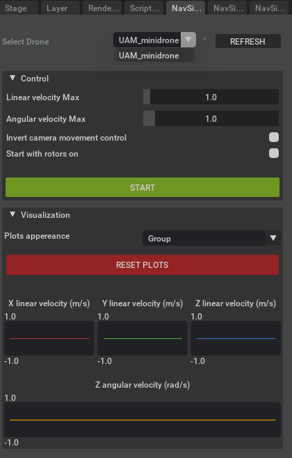
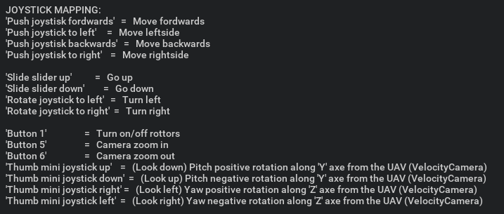
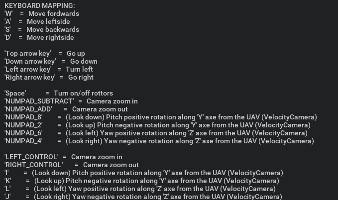

# 01: Running your first simulation

In this tutorial you will learn to execute a simulation by opening a scenario, placing some UAVs over the terrain and 
controlling them by means of a Thrustmaster joystick (other joysticks may work but it is no guaranteed).

## Launch Isaac Sim

First, open the simulation environment NVIDIA Isaac Sim. Once opened, it will offer a similar aspect as the following
picture (the panels' location may differ depending on the personal configuration):

## Launch the scenario

In the *Content* panel, find the file `navsim/ov/assets/worlds/campus/campus.usd` and doble click on it.
It will open a scenario where our campus is detailed.

Under *Stage* panel, find `World/Vertiports/minidrone_vertiport` prim (a prim is how models are called in USD), select 
it and press *F* key to focus (make zoom) on it.
Then drag and drop the file `navsim/ov/fleet/UAM_minidrone/UAM_minidrone.usd` over the vertiport. It will appear a 
quadcopter in the scene. You can elevate it a bit and click on *PLAY* button to start the
simulation. You will see that the UAV falls. Besides, you can have a look at its internal components under the *Stage*
panel.

https://github.com/user-attachments/assets/68807db9-35ee-4cd5-9f48-3e62e3f2b44c

## Control the UAV

Now we are going to control the UAV using the joystick. For this we need to work with our own extension named 
*Navsim - Manual Controller*.
In this extension we have two main parts, the *Control* and *Visualization* tabs.
- Control
    - Linear velocity Max: It limits the linear velocity the UAV can reach.
    - Angular velocity Max: As linear one but for rotation.
    - Invert camera movement control: Invert the axes movevement from the camera that follows the UAV.
    - Start with rotors on: Whether to start controlling the UAV with its rottors on or not.

- Visualization
    - Plot appereance: It changes the distribution of the plots within this tab.
    - This is used to make sure our joystick is working, so once we have made sure it does we can collapse the tab.

In order to control a UAV we have to tell the extension which one we want, so click on *REFRESH* button at the top of 
the extension to repopulate the dropdown selector. Then you can choose the desired UAV.

Right now we will only set *Linear velocity Max* parameter to 4. Then we are ready to click on *START* button. This 
will create a camera which will follow the UAV during the simulation. You can move it using the joystick too.
Before begging the simulation, have a look at the controls of the joystick in the following picture (for further details
have a look at the *OVERVIEW* section from the extension within the `Window/Extensions` panel).

In case you do not have any joystick, we also have support to keyboard. Here you have the mapping:

Let's play with a bigger UAV now!
Repeat the same process as in the *Launch the scenario* section (this time do not open campus.usd as it is already 
loaded), but focus on the `World/Vertiports/aerotaxi_vertiport` and drag and drop the file 
`navim/of/fleet/UAM_aerotaxi/UAM_aerotaxi.usd`.
Under the *NavSim - Manual Controller* extension refresh and select the new UAV. Increase the linear velocity Max to 10
and start playing.

https://github.com/user-attachments/assets/c91937dc-aedb-44f1-bc43-e06f3ec806af
