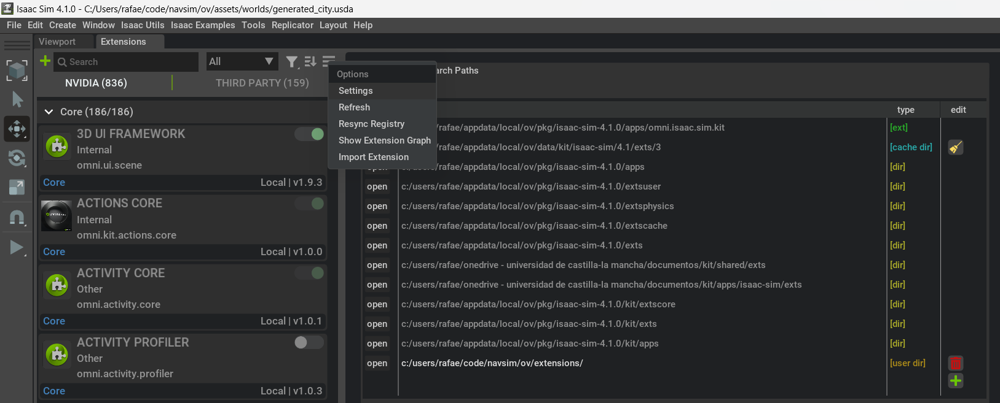

# 01: Running your first simulation

En este tutorial aprenderás a ejecutar una simulación abriendo un escenario, 
colocaremos varios drones sobre el terreno y los controlaremos mediante la emisión de comandos básicos.

## Launch Isaac Sim

En primer lugar, abrimos el entorno de simulación NVIDIA Isaac Sim, que ofrecerá un aspecto similar al de la figura siguiente 
(los paneles pueden variar en función de la configuración personal):

## Cargamos las extensiones necesarias

Abrimos la ventana de extensiones desde el menu superior `Window/Extensions`

Abrimos los ajustes de esta ventana `Options/Setting`, 
buscamos en nuestro disco duro la fuente `navsim/ov/extensions/` y la añadimos a *Extension Search Paths*.

Entonces, elegimos la lengueta *THIRD PARTY*, y el desplegable *User*. 
Ahí encontraremos las extensiones propias de NavSim. 
Activamos la extensión *NAVSIM REMOTE COMMAND* (podemos marcar la opción de que se cargue en el arranque.
Observamos como se abre en la pantalla el panel correspondiete.
Lo desplazamos y ajustamos a la interfaz a nuestro gusto.

## Launch the scenario

En la ventana de contenidos, buscamos el archivo `ov/assets/worlds/generated_city.usda`, y hacemos doble click sobre él. 
Se abre un escenario de 500x500 metros, con 61 bloques que representan edificios.

Con la rueda del ratón hacemos zoom hasta mostrar la azotea de un edificio.
Buscamos en el panel *Content* el archivo `navsim/ov/fleet/UAM_minidrone/UAM_minidrones.usd` y lo arrastramos al escenario 3 veces.
Aparecen tres quadricopteros en escena, elévalos ligeramente por encima del tejado del edificio y pulsa *PLAY*. Los drones caen sobre la superficie.
En el panel *Stage* observamos los tres drones convenientemente renombrados. Podemos estudiar sus componentes internas.

En el panel *REMOTE COMMAND* pulsamos el botón *REFRESH*.
La lista desplegable se carga con los nombres de los tres quadricópteros.
Elegimos uno de ellos.

Asignamos `velZ = 1.0` y pulsamos *SEND*. El dron correspondiente se eleva a 1m/s durante 1 segundo.

Asignamos `velZ = 0.0`, `rotZ = 1.0`, `duration = 6.28`,  y pulsamos *SEND*. 
El dron rota sobre sí mismo a 1 rad/s durante 6.28 segundos, dando una vuelta completa.

Finalmente, desmarca la casilla *ON* y envía el comando. El dron detiene sus motores, precipitándose sobre la superficie.

Experimenta con otros drones. No olvides que:
- el *ejeX* (rojo) es el eje longitudinal del dron, positivo hacia delante.
- el *ejeY* (verde) es el eje lateral del dron, positivo hacia la izquierda.
- el *ejeZ* (azul) es el eje vertical del dron, positivo hacia arriba.
- la rotación en el eje vertical es positiva en sentido antihorario.

Por último, debes saber que cada drone lleva una cámara incorporada. 
Desde el menú *Window/Viewport*, podemos abrir el *Viewport 2* y asociar una de esas cámaras.

