# 04: Executing smoothed flight plans


## Routes computation

Open Matlab and navigate to `navsim/matlab/simulations/tutos/tuto4`.
Open the script `computation.m` and execute it.


Before defining a flight plan, we set the ground location of the origin and destination vertiports:

```matlab
% -------------
% Vertiports location
%               x        y        z       rz
portsLoc = [ -190.00  -119.00  +048.00    pi/2
             -152.00  -106.00  +049.00    pi/2   ];
vp1 = portsLoc(1,1:3);
vp2 = portsLoc(2,1:3);
```


The flight plan will consist of 6 waypoints at the established flight altitude.
Additionally, the first and the last ones will have two extra waypoints located below them in the takeoff and landing zones.
We will label all the waypoints to access them directly when they were incorporated into the flight plan.

We define the first waypoint 10 cm above the departure vertiport,
a second waypoint in the same place (so the drone makes a pause there),
and the first waypoint of the route, exactly above the previous ones, at an altitude of 70 meters (the vertiports are located less than 50 m high).

```matlab
wp1L = Waypoint;        % low waypoint
wp1L.label = 'wp1L';
wp1L.pos = vp1 + [0 0 0.10];

wp1P = Waypoint;        % pause waypoint
wp1P.label = 'wp1P';
wp1P.pos = wp1L.pos;

wp1 = Waypoint;
wp1.label = 'wp1';
wp1.pos = wp1L.pos;
wp1.pos(3) = 70;
```


Next, we establish 5 transit waypoints:

```matlab
wp2 = Waypoint;
wp2.label = 'wp2';
wp2.pos = wp1.pos + [100 100 0];

wp3 = Waypoint;
wp3.label = 'wp3';
wp3.pos = wp2.pos + [0 200 0];

wp4  = Waypoint;
wp4.label = 'wp4';
wp4.pos = wp3.pos + [200 0 0];

wp5  = Waypoint;
wp5.label = 'wp5';
wp5.pos = wp4.pos + [0 -300 0];
```

And we finish the route with three waypoints associated with the destination vertiport:

```matlab
wp6L = Waypoint;
wp6L.label = 'wp6L';
wp6L.pos = vp2 + [0 0 0.10];

wp6P = Waypoint;
wp6P.label = 'wp6P';
wp6P.pos = wp6L.pos;

wp6 = Waypoint;
wp6.label = 'wp6';
wp6.pos = wp6L.pos;
wp6.pos(3) = wp1.pos(3);
```

Now we will generate a flight plan that connects all the waypoints:

```matlab
fp1  = FlightPlan(Waypoint.empty);
fp1.radius = 2;
fp1.AppendWaypoint(wp1L);
wp1P.t = fp1.FinishTime + 5;
fp1.SetWaypoint(wp1P);
fp1.AppendWaypoint(wp1);
fp1.AppendWaypoint(wp2);
fp1.AppendWaypoint(wp3);
fp1.AppendWaypoint(wp4);
fp1.AppendWaypoint(wp5);
fp1.AppendWaypoint(wp6);
fp1.AppendWaypoint(wp6L);
wp6P.t = fp1.FinishTime + 5;
fp1.SetWaypoint(wp6P);
```

We set the time for each waypoint based on the desired travel speed:

```matlab
fp1.SetTimeFromVel('wp1' ,2);
fp1.SetTimeFromVel('wp2' ,8);
fp1.SetTimeFromVel('wp3' ,8);
fp1.SetTimeFromVel('wp4' ,8);
fp1.SetTimeFromVel('wp5' ,8);
fp1.SetTimeFromVel('wp6' ,8);
fp1.SetTimeFromVel('wp6L',2);
```

We assign the velocity vector for each waypoint to achieve uniform straight-line motion, and observe the result:

```matlab
fp1.SetV0000;
fp1.PositionFigure("FP1: POSITION",0.01);
fp1.VelocityFigure("FP1: VELOCITY",0.01);
```

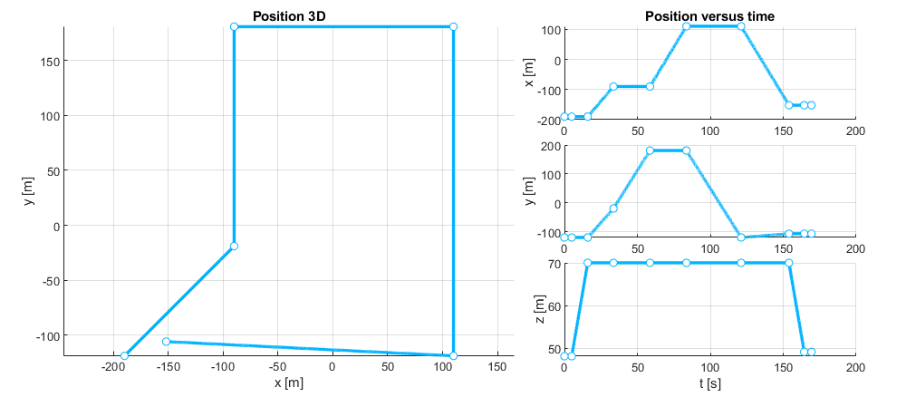
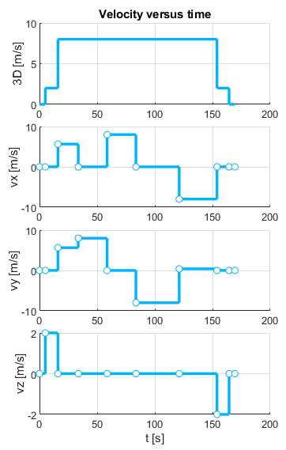


Next, we make a copy of the previous route with the intention of smoothing it out. In the copy, we slightly shift the pair of starting points so that two drones can fly these plans without colliding during takeoff:

```matlab
fp2 = fp1.Copy;
fp2.waypoints(1).pos = fp2.waypoints(1).pos + [0.5 0 0];
fp2.waypoints(2).pos = fp2.waypoints(2).pos + [0.5 0 0];
```

We assume finite angular velocity and linear acceleration, and smooth out the route:

```matlab
ang_vel = 0.1;
lin_acel =0.4;

fp2.SmoothVertexMaintainingDuration('wp1P',ang_vel,lin_acel);
fp2.SmoothVertexMaintainingDuration('wp1',ang_vel,lin_acel);
fp2.SmoothVertexMaintainingSpeed('wp2',ang_vel);
fp2.SmoothVertexMaintainingSpeed('wp3',ang_vel);
fp2.SmoothVertexMaintainingSpeed('wp4',ang_vel);
fp2.SmoothVertexMaintainingSpeed('wp5',ang_vel);
fp2.SmoothVertexMaintainingDuration('wp6',ang_vel,lin_acel);
fp2.SmoothVertexMaintainingDuration('wp6L',ang_vel,lin_acel);

fp2.PositionFigure("FP2: POSITION",0.1);
fp2.VelocityFigure("FP2: VELOCITY",0.1);
```

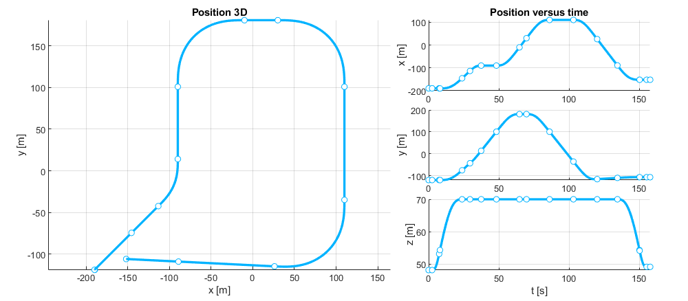
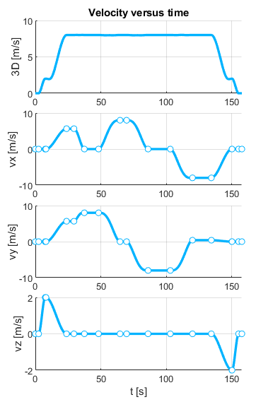


We can observe how each smoothed waypoint has been split into two.

- If the operation maintains the duration, the drone will adjust its speed to fit the smoothed trajectory within that time.
- Conversely, if the operation maintains the speed, then the flight plan will shorten in time because the resulting smoothed route will be shorter.


## Executing the simulation


### Gazebo

First, we open a scenario in the Gazebo simulator (in the same computer or other computer connected to the same subnetwotk):
```bash
cd
cd code/navsim/ws/src/navsim_pkg/worlds
gazebo generated_city.world
```
Gazebo shows a small city of 500x500 meters in which blocks represent buildings.
You can zoom out to observe the whole city.

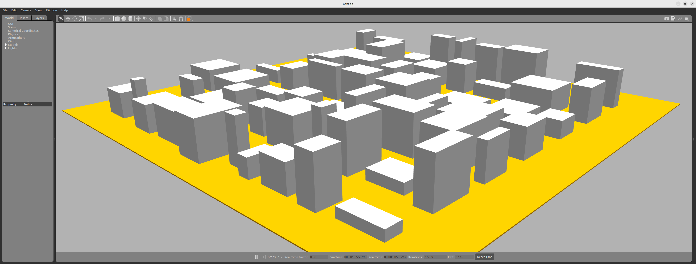


As in the previous tutorials, in a new terminal, verify that the ROS2 **/World** node is running correctly:
```bash
ros2 node list
```

Also verify that this node manages a service **/NavSim/DeployModel** for deploying objects in the area:
```bash
ros2 service list | grep Deploy
```


### Matlab


Now open Matlab (in the same computer or other computer connected to the same subnetwotk).
Navigate to `navsim/matlab/simulations/tutos/tuto4`. From here, open the script `simulation.m` and execute it. 

>We are experiencing issues with accessing ROS2 communications from Matlab on Ubuntu platforms. Therefore, we recommend running the Matlab portion of this tutorial from a Windows system connected via the network to the Ubuntu system running the Gazebo simulator.

This code employs a **SimpleBuilder** to deploy vertiports in the area, a **USpaceOperator** to manage the operation of several drones, and a **SimpleMonitor** to analyze their accuracy executing flight plans.

> In some parts of the code, pauses are incorporated with the `pause( )` command.
> This is done to allow time for ROS2 nodes to wake up and handle pending requests before continuing with the program.


```matlab
builder  = SimpleBuilder ('builder' ,NAVSIM_MODELS_PATH);
operator = USpaceOperator('operator',NAVSIM_MODELS_PATH);
monitor  = SimpleMonitor('monitor');
```

Next, we place 2 vertiports on the rooftops of 2 buildings. In Gazebo, if we restore the camera to its original position, we can see them in the foreground. 

```matlab
% vertiports
for i = 1:size(portsLoc,1)
    id = sprintf('BASE%02d', i);
    builder.DeployModel('UAM/vertiport_H', id, ...
        portsLoc(i,1:3), ...
        [0 0 portsLoc(i,4)]);
    operator.SetVertiport(id,portsLoc(i,1:3),1);
end
```

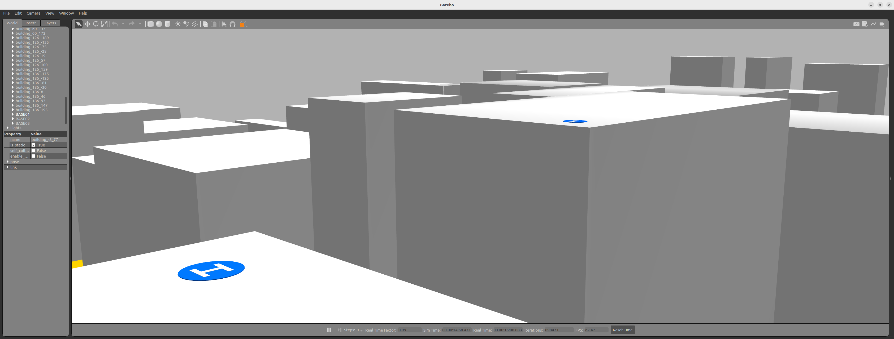

We configure the performance of the drones:

```matlab
% -------------
% UAV performance
info = UAVinfo('',UAVmodels.MiniDroneFP1);
info.maxForwardVel   = 12;    % m/s
info.maxForwardAcel  =  1;    % m/s2
info.maxVerticalVel  =  3;    % m/s  
info.maxVerticalAcel =  1;    % m/s2
info.maxAngularVel   =  5;    % rad/s
info.maxAngularAcel  =  1;    % rad/s2
```


Next, we deploy two drones (_UAV01_ and _UAV02_) in the starting vertiport.
.We also instruct the **monitor** to start storing the telemetry information transmitted by each of them.

```matlab
% Deploy UAVs
operator.DeployUAV(info,'UAV01', ...
    [ -190.00  -119.00  +048.10 ],...
    [    0.00     0.00     pi/4  ]);
monitor.TrackUAV('UAV01');

operator.DeployUAV(info,'UAV02', ...
    [ -189.50  -119.00  +048.10 ],...
    [    0.00     0.00     pi/4 ]);
monitor.TrackUAV('UAV02');
```
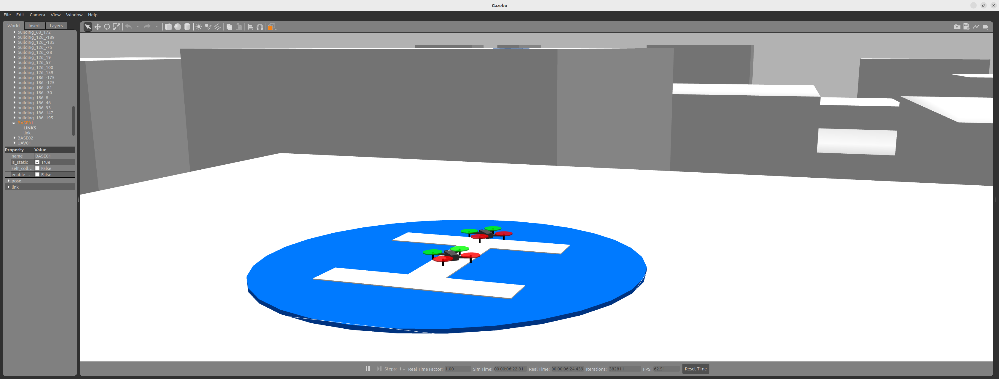


We reprogram the flight plans to execute within 10 seconds and transmit them to the respective drones.

```matlab
time = operator.GetTime();

fp1.RescheduleAt(time + 10);
operator.SendFlightPlan('UAV01',fp1);
pause(0.2);
fp2.RescheduleAt(time + 10.2);
% fp3 = fp2.Convert2TP(0.25);
operator.SendFlightPlan('UAV02',fp2);
```

At this point, we ask the operator to wait until the drones have finished executing their respective flight plans. 
Then, if desired, we can remove them from the scenario. Finally, we stop the simulation.

```matlab
operator.WaitTime(max(fp1.FinishTime,fp2.FinishTime));
operator.PauseSim;
```

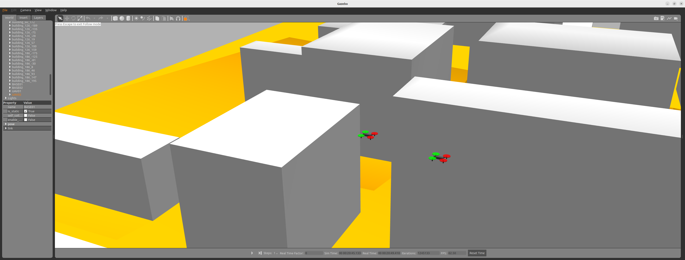


Now is the time to evaluate what happened.
We request the **monitor** for the temporal graphs of the position and velocity of each drone during the execution of the flight plan.

```matlab
monitor.PositionFigure('UAV01',fp1,0.01);
monitor.VelocityFigure('UAV01',fp1,0.01);
monitor.PositionFigure('UAV02',fp2,0.01);
monitor.VelocityFigure('UAV02',fp2,0.01);
```

Next, in the position graph, we can see how _UAV01_ has had difficulties in following the trajectory accurately whenever it changed abruptly, resulting in errors of up to 20 meters. In the velocity graph, we observe the constant corrections needed to regain position.

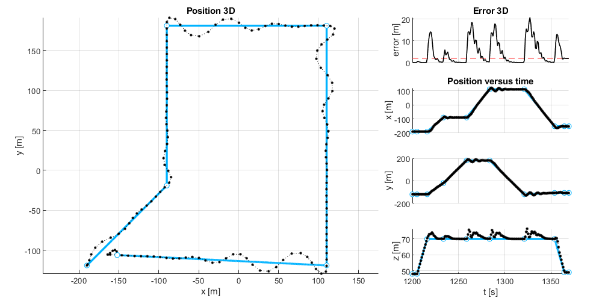
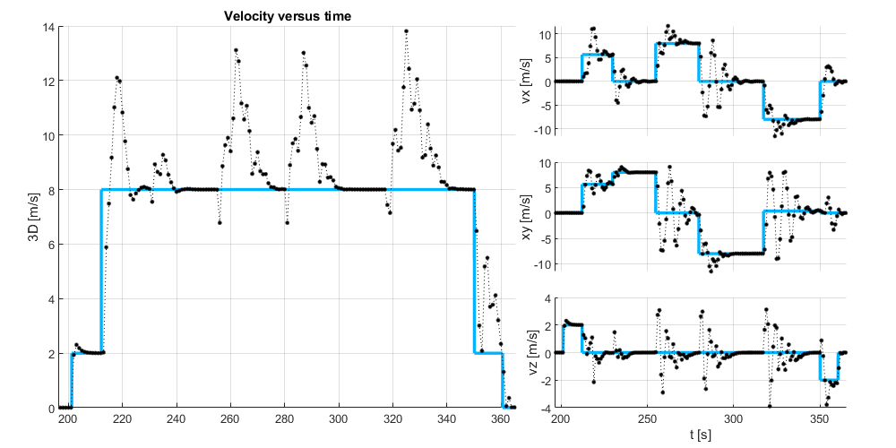

In contrast, _UAV02_ has executed the smoothed maneuver perfectly. It has experienced only a 1-meter error in horizontal maneuvers and a 2-meter error in altitude changes. In the velocity graph, we can see that the flight has been smooth and without any disturbances.

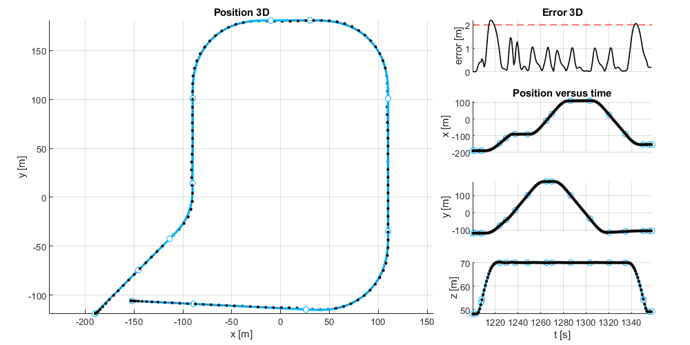
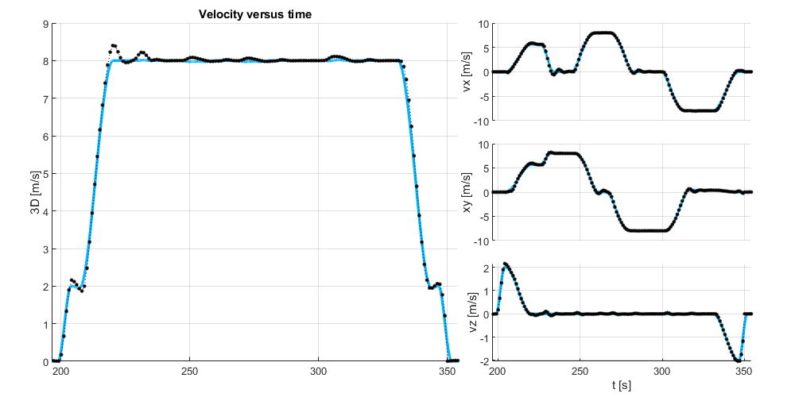

The final position of both drones at the destination vertiport summarizes the situation. _UAV01_ has landed outside the designated landing area, whereas _UAV02_ has landed correctly.

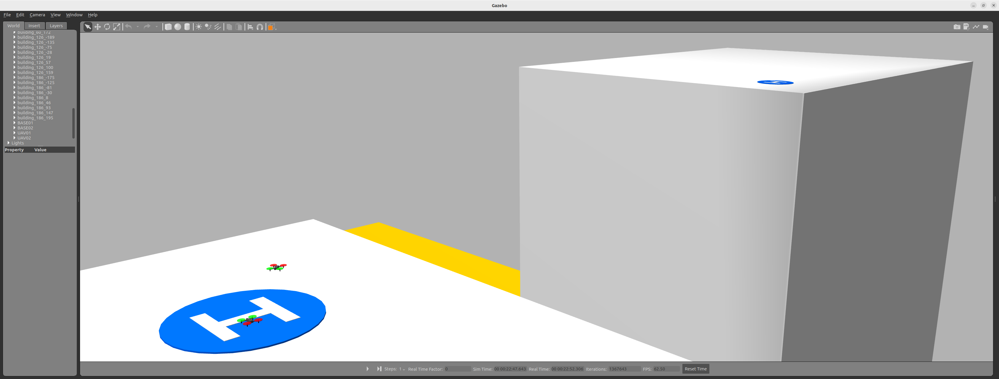
