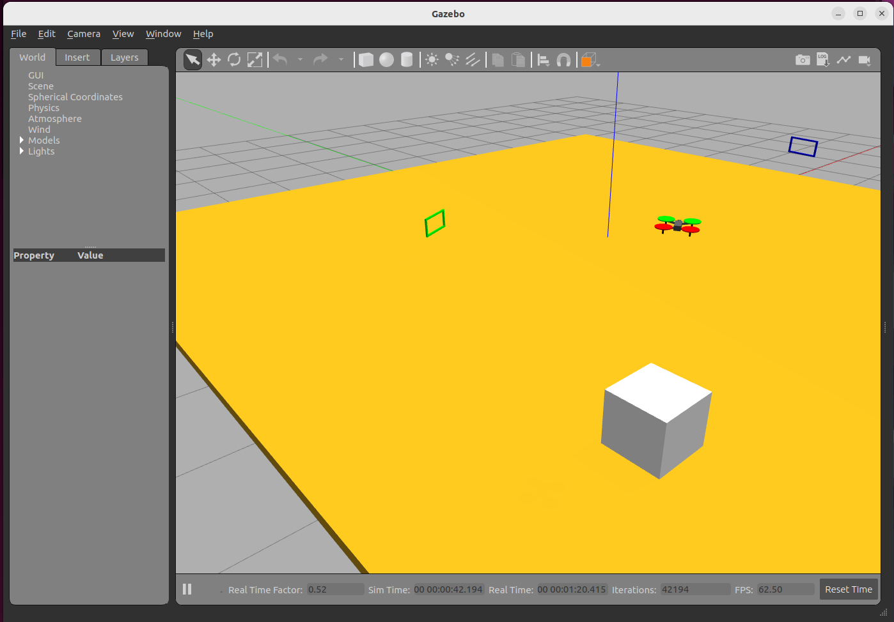

# 01: Running your first simulation with Matlab connection

## Launch the scenario

First, we open a scenario in the Gazebo simulator:

```bash
cd
cd code/navsim/ws/src/navsim_pkg/worlds
gazebo DroneChallenge.world
```
An environment should open with a gaming area of 10x10 meters. On a white base (the _vertiport_), there is a quadcopter (called _abejorro_). Floating in the air, you could see three frames colored red, green, and blue, respectively.


In a new terminal, we can verify that ROS is running correctly:
```bash
ros2 node list
```
The command shows four active nodes at the moment.


## Check world node

The node **/World** is associated with the loaded scenario. 

```bash
ros2 topic list
```
We observe that this node generates a topic **/World/Time** where we can check the simulation time.

```bash
ros2 topic type /World/Time
ros2 interface show builtin_interfaces/msg/Time
ros2 topic echo /World/Time
```
With these commands, we can determine the structure of the transmitted message, and observe as the data refreshes 10 times per second.

```bash
ros2 service list | grep World
```
We check that there are (among others) two services associated with this node, named **/World/DeployModel** and **/World/RemoveModel** respectively. The former is more complex to use and will be covered in a later tutorial. The latter service allows us to remove an element from the scenario.
```bash
ros2 service type /World/RemoveModel 
ros2 interface show navsim_msgs/srv/RemoveModel
```
We see that we can call the service simply by indicating the name of the object we want to remove. As an example, let's remove the landing pad with the command:
```bash
ros2 service call /World/RemoveModel navsim_msgs/srv/RemoveModel "{name: 'vertiport'}"
```
We see that the landing pad disappears, and the drone falls to the ground.
Before proceeding, close Gazebo and let's load the original scenario again to recover the vertiport.

```bash
gazebo DroneChallenge.world
```


## Check UAV node

Each UAV generates its own ROS node to interact with the environment. In this case, the node for the quadcopter is named **/abejorro**.
This node manages the transmission of telemetry information and the reception and execution of control commands.


### Telemetry

All existing UAVs will publish their telemetry information on the **/UAV/Telemetry** topic.

```bash
ros2 topic list | grep UAV
ros2 topic info /UAV/Telemetry
```
We can see that there is a node transmitting messages on this topic. 

```bash
ros2 interface show navsim_msgs/msg/Telemetry
```
The telemetry message contains:
- Aircraft identifier
- Position and orientation
- body linear and angular velocities
- Simulation time when the data was generated

```bash
ros2 topic echo /UAV/Telemetry
```
This data is updated once per second.

### Navigation

Each UAV has its own control topic, unlike telemetry transmission where all UAVs share a single topic.
Let's examine the topic with these commands:

```bash
ros2 topic list | grep UAV
ros2 topic type /UAV/abejorro/RemoteCommand
ros2 interface show navsim_msgs/msg/RemoteCommand 
```
We observe that the control topic is named **/UAV/abejorro/RemoteCommand**. The command includes:
- Aircraft identifier (only required in cases where the topic refers to a swarm)
- Activation/deactivation of rotors
- Commanded linear velocity (expressed in horizon axes)
- Commanded angular velocity (only around the vertical axis)
- Command expiration time.

As an example of use, we can move the quapcopter publishing the following commands:
```bash
ros2 topic pub -1 /UAV/abejorro/RemoteCommand navsim_msgs/msg/RemoteCommand "{'on': true, 'vel': {'linear': {z: 1}}, 'duration': {'sec': 1}}"
ros2 topic pub -1 /UAV/abejorro/RemoteCommand navsim_msgs/msg/RemoteCommand "{'on': true, 'vel': {'linear': {x: 1}, 'angular': {z: 1}}, 'duration': {'sec': 6}}"
ros2 topic pub -1 /UAV/abejorro/RemoteCommand navsim_msgs/msg/RemoteCommand "{'on': false}"
```



## Check UAV cameras

```bash
ros2 node list | grep _cam
```
This quadcopter has two cameras. Each of them generates its own node for image transmission:
- **/onboard_cam** is a real camera mounted on the front of the fuselage. 
- **/follow_cam** is a virtual camera located at a certain height behind the aircraft. 

```bash
ros2 topic list | grep _cam
ros2 topic echo /UAV/abejorro/onboard_cam/image_raw --no-arr
ros2 topic echo /UAV/abejorro/follow_cam/image_raw --no-arr
```
Each camera generates two topics, transmitting camera information and raw image respectively. 
- **/UAV/abejorro/onboard_cam/image_raw** is transmitting 320x240 RGB pixels at 10 FPS. 
- **/UAV/abejorro/follow_cam/image_raw** is transmitting 480x320 RGB pixels at 10 FPS.


## Launch the human pilot interface

> Warning: This step requires having a joystick connected to the computer running Matlab / Simulink. If you don't have one, you can skip this section and proceed to the next one.
> This tutorial has been conducted using a **Thrustmaster T.Flight Stick X** joystick model.

In the Matlab environment, navigate to the `navsim/matlab/operators/DroneChallenge` directory. From there, open the `HumanPilot.slx` model.
Press the **Run** button to execute the model. After compilation, two additional windows will open, displaying video captured by the drone cameras. 
You can rearrange, resize, or close these windows as desired.


On the right, the model provides a speedometer and a maximum speed limiter. It is recommended to set the speed below 1 m/s in the initial attempts.


On the left, there is a joystick diagram including a circular LED. It indicates whether the quadcopter rotors are on (green) or off (red).
- To turn on the motors, press button 1 on the joystick (index finger). Initially, the drone stabilizes, and it may not be immediately apparent that the motors are on. Check the LED if in doubt.
- To turn off the motors, press button 2 on the joystick (thumb). The drone will descend to the ground if it was hovering in the air.

With the motors on, the drone stabilizes automatically. Then, you can:
- ascend/descend: employing the thrust lever.
- do planar movement: moving the stick.
- rotate: rotating the stick.

Try piloting the drone to pass through the red, green, and blue frames in order and then return to the vertiport. Record the time from when the motors are activated until they are deactivated again. The pilot with the shortest completion time will be the winner.

Enjoy the game!


## Launch the computer pilot

Stop the human pilot interface if it is still running. From Matlab, open the **ComputerPilot.slx** model.


En esta ocasión, el piloto automática está programado en un StateFlow chart. 
A partir de la información de telemetría y la cámara frontal del dron, el sistema debe realizar el circuito completo por sí mismo (sin intervención humana).


