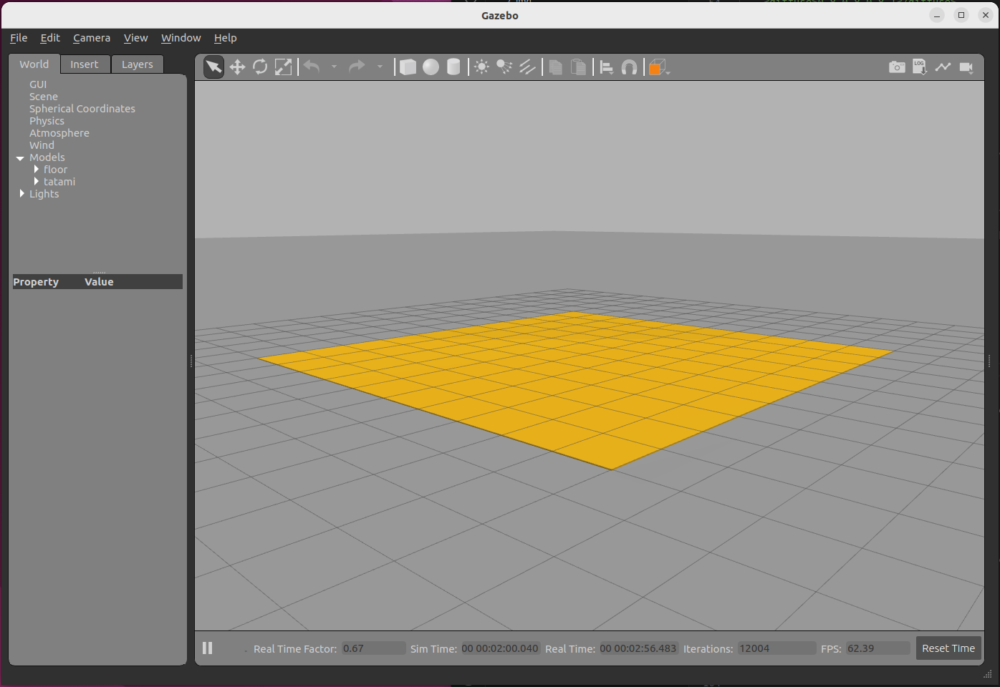
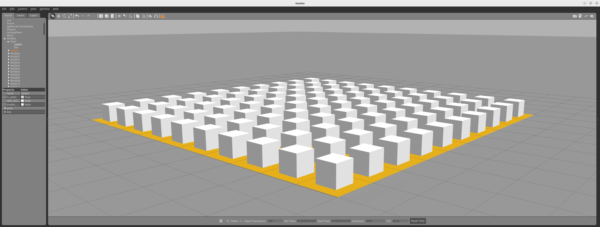

# 02: Running 100 drones

## Gazebo

First, we open a scenario in the Gazebo simulator:

```bash
cd
cd code/navsim/ws/src/navsim_pkg/worlds
gazebo tatami.world
```
An environment should open with a gaming area of 10x10 meters.




As in the previous tutorial, in a new terminal, verify that the ROS2 **/World** node is running correctly:
```bash
ros2 node list
```

Also verify that this node manages a service for deploying objects in the area:
```bash
ros2 service list | grep Deploy
```

## Matlab

Now open Matlab (in the same computer or other computer connected to the same subnetwotk).
Navigate to `navsim/matlab/simulations/tutos/tuto2`. From here, open the script `OnHundredDrones.m` and execute it.

This code uses a **SimpleBuilder** object to generate 100 boxes in the area:

```matlab
builder  = SimpleBuilder ("builder" ,NAVSIM_MODELS_PATH);
for i=0:9
    for j = 0:max
        builder.DeployModel('DC/base_drone', ...
            ['BASE',num2str(i),num2str(j)], ...
            [i-4.5 j-4.5 0.26],[0 0 0]);
    end
end
```




