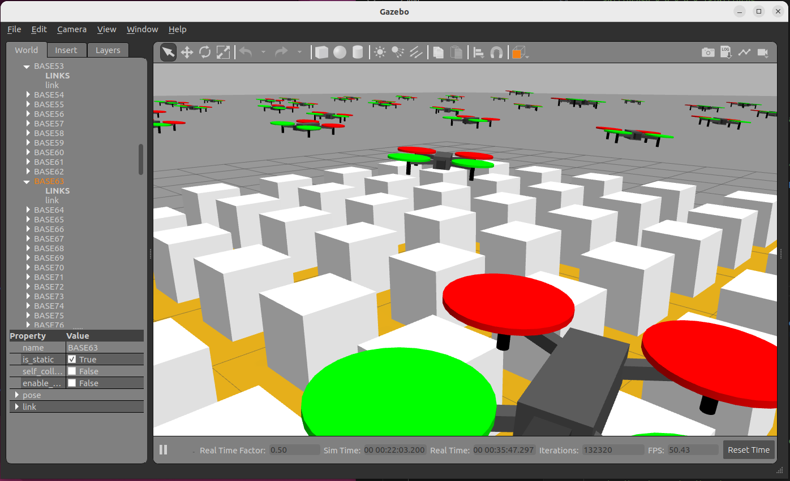

# 02: Running 100 drones

## Gazebo

First, we open a scenario in the Gazebo simulator:

```bash
cd
cd code/navsim/ws/src/navsim_pkg/worlds
gazebo tatami.world
```
An environment should open with a gaming area of 10x10 meters.


As in the previous tutorial, in a new terminal, verify that the ROS2 **/World** node is running correctly:
```bash
ros2 node list
```

Also verify that this node manages a service for deploying objects in the area:
```bash
ros2 service list | grep Deploy
```

## Matlab

Now open Matlab (in the same computer or other computer connected to the same subnetwotk).
Navigate to `navsim/matlab/simulations/tutos/tuto2`. From here, open the script `OnHundredDrones.m` and execute it.

This code uses a **SimpleBuilder** object to generate 100 boxes in the area:

```matlab
builder  = SimpleBuilder ("builder" ,NAVSIM_MODELS_PATH);
for i=0:9
    for j = 0:9
        builder.DeployModel('DC/base_drone', ...
            ['BASE',num2str(i),num2str(j)], ...
            [i-4.5 j-4.5 0.26],[0 0 0]);
    end
end
```


Now, we use a **USpaceOperator** object to generate 100 drones over the boxes:

```matlab
operator = USpaceOperator("operator",NAVSIM_MODELS_PATH);
for i=0:9
    for j = 0:9
        operator.DeployUAV(                ...
            UAVmodels.MiniDroneCommanded,  ...
            ['UAV',num2str(i),num2str(j)], ...
            [i-4.5 j-4.5 1],[0 0 0]);
    end
end
```


Finally, let's command the drones to activate, ascend for 1 second from their positions, and then perform a circular maneuver for 30 seconds:

```matlab
for i=0:9
    for j = 0:9
        operator.RemoteCommand( ...
            ['UAV',num2str(i),num2str(j)], ...
            true,0,0,0.5,0,1);
    end
end

pause(2)

for i=0:9
    for j = 0:9
        operator.RemoteCommand( ...
            ['UAV',num2str(i),num2str(j)], ...
            true,2,0,0,1,30);
    end
end
```



It can be observed that the drones perform the requested actions. However, they do so disorderly, as they receive commands, with a margin of up to a second in some cases. The consequence is that several devices collide in the air. Some of them manage to recover and continue the maneuver from another position, while others fall to the ground.

The goal of USpace is to provide compatible spatiotemporal paths, and for drones to be able to execute them precisely, to prevent such incidents from happening.

