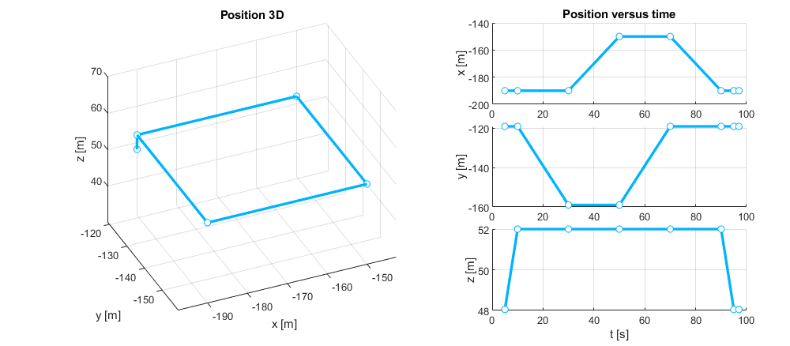
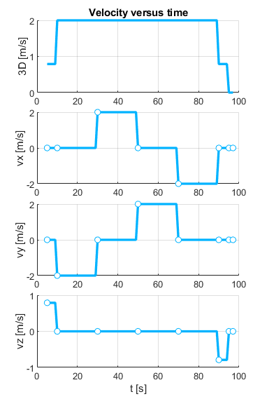
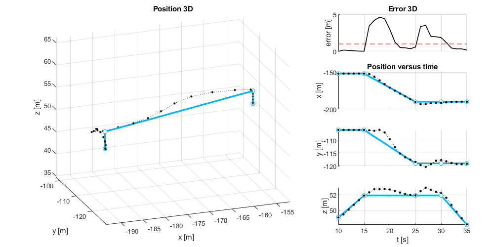
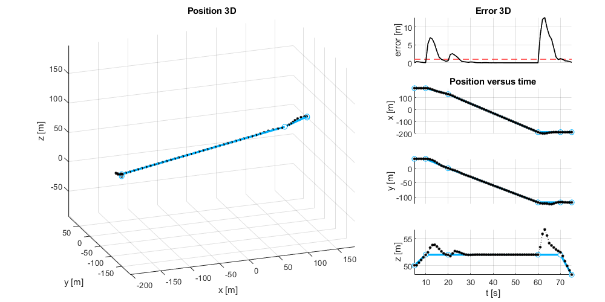

# 03: Executing Time/Position-based Flight Plans

## Gazebo

First, we open a scenario in the Gazebo simulator:

```bash
cd
cd code/navsim/ws/src/navsim_pkg/worlds
gazebo generated_city.world
```
Gazebo shows a small city of 500x500 meters in which blocks represent buildings.
You can zoom out to observe the whole city.


As in the previous tutorials, in a new terminal, verify that the ROS2 **/World** node is running correctly:
```bash
ros2 node list
```

Also verify that this node manages a service **/NavSim/DeployModel** for deploying objects in the area:
```bash
ros2 service list | grep Deploy
```

## Matlab

### CreateObject.m

Now open Matlab (in the same computer or other computer connected to the same subnetwotk).
Navigate to `navsim/matlab/simulations/tutos/tuto3`. From here, open the script `CreateObjets.m` and execute it.


This code employs a **SimpleBuilder** to deploy vertiports in the area, a **USpaceOperator** to manage the operation of several drones, and a **SimpleMonitor** to analyze their accuracy executing flight plans.

```matlab
builder  = SimpleBuilder ('builder' ,NAVSIM_MODELS_PATH);
operator = USpaceOperator('operator',NAVSIM_MODELS_PATH);
monitor  = SimpleMonitor('monitor');
```
First, we place 3 vertiports on the rooftops of 3 buildings. If we restore the camera to its original position, we can see two of them in the foreground. The third vertiport is located on one of the buildings in the background to the right of the screen.

```matlab
% -------------
% Set vertiports
%               x        y        z       rz
portsLoc = [ -190.00  -119.00  +048.00    pi/2
             -152.00  -106.00  +049.00    pi/2
             +180.00  +033.00  +050.00    00
           ];

for i = 1:size(portsLoc,1)
    id = sprintf('BASE%02d', i);
    builder.DeployModel('UAM/vertiport_H', id, ...
        portsLoc(i,1:3), ...
        [0 0 portsLoc(i,4)]);
end
```


We configure the performance of the drones:

```matlab
info = UAVinfo('',UAVmodels.MiniDroneFP1);
info.velMax = 10;
```

Next, we deploy our small fleet of drones, each in a different vertiport. 
We designate the devices as _UAV01_, _UAV02_, and _UAV03_, respectively.
We also instruct the **monitor** to start storing the telemetry information transmitted by each of them.

```matlab
%% -------------
% Deploy fleet
%               x        y        z       rz
fleetLoc = [ -190.00  -119.00  +048.10    pi/2
             -152.00  -106.00  +049.10    pi/2
             +180.00  +033.00  +050.10    -0.9*pi
           ];
for i = 1:size(fleetLoc,1)
    id = sprintf('UAV%02d', i);
    operator.DeployUAV(info,id, ...
        fleetLoc(i,1:3), ...
        [0 0 fleetLoc(i,4)]);
    monitor.TrackUAV(id);
end
```


### FlightPlannig_TP.m

Now, open the script `FlightPlannig_TP.m` and execute it. 

First, we create a flight plan for each drone. 
A TP (Time/Position) flight plan is a sequence of waypoints that reflect positions the device should be at specific moments. 
Of course, the waypoints are ordered chronologically, even if they were inserted in a different order. 
Inserting a waypoint overwrites another existing one at the same time.

```matlab
% -------------
%Create a Flight Plan for the drone 1
%              t      x        y        z    
way_data1 = [ 05   -190.00  -119.00  +048.05   
              10   -190.00  -119.00  +052.00   
              30   -190.00  -159.00  +052.00   
              50   -150.00  -159.00  +052.00   
              70   -150.00  -119.00  +052.00   
              90   -190.00  -119.00  +052.00   
              95   -190.00  -119.00  +048.05  
              97   -190.00  -119.00  +048.05  ];

fp1  = FlightPlan(Waypoint.empty);

for i = 1:size(way_data1,1)
    wp = Waypoint();
    wp.t = way_data1(i,1);
    wp.SetPosition(way_data1(i,2:4));
    fp1.SetWaypoint(wp);
end
```

The flight plan for UAV01 involves ascending a few meters, performing a closed rectangular trajectory, and landing at the same point.




UAV02 and UAV03 will move from their respective vertiports to the first one.

```matlab
% -------------
%Create a Flight Plan for the drone 2
%              t      x        y        z    
way_data2 = [ 10   -152.00  -106.00  +049.05   
              15   -152.00  -106.00  +051.90   
              25   -190.00  -119.00  +051.90
              30   -190.00  -119.00  +051.90
              35   -190.00  -119.00  +048.10  ];

fp2  = FlightPlan(Waypoint.empty);
for i = 1:size(way_data2,1)
    wp = Waypoint();
    wp.t = way_data2(i,1);
    wp.SetPosition(way_data2(i,2:4));
    fp2.SetWaypoint(wp);
end

% -------------
%Create a Flight Plan for the drone 3
%              t      x        y        z    
way_data3 = [  5   +180.00  +033.00  +050.00
              10   +180.00  +033.00  +052.00   
              20   +130.00  +000.00  +052.00
              60   -190.00  -119.00  +052.00
              70   -190.00  -119.00  +052.00
              75   -190.00  -119.00  +048.30  ];

fp3  = FlightPlan(Waypoint.empty);
for i = 1:size(way_data3,1)
    wp = Waypoint();
    wp.t = way_data3(i,1);
    wp.SetPosition(way_data3(i,2:4));
    fp3.SetWaypoint(wp);
end
```

Once we have designed the flight plans, we transmit them to the drones. 
Before doing that, we reset the simulation time to prevent the plans from becoming outdated. 
At this point, we ask the operator to wait until the drones have finished executing their respective flight plans. 
Then, if desired, we can remove them from the scenario. Finally, we stop the simulation.

> In some parts of the code, pauses are incorporated with the `pause( )` command.
> This is done to allow time for ROS2 nodes to wake up and handle pending requests before continuing with the program.

```matlab
% -------------
%Comunicate Flight Plans
operator.ResetSim;
operator.SendFlightPlan('UAV01',fp1);
operator.SendFlightPlan('UAV02',fp2);
operator.SendFlightPlan('UAV03',fp3);

% -------------
%Wait Flight Plans execution
operator.WaitTime(max([fp1.FinishTime fp2.FinishTime fp3.FinishTime]));
% operator.RemoveUAV('UAV01');
% operator.RemoveUAV('UAV02');
% operator.RemoveUAV('UAV03');
operator.PauseSim;
```


Now is the time to evaluate what happened.
We request the **monitor** for the temporal graphs of the position and velocity of each drone during the execution of the flight plan.

```matlab
monitor.PositionFigure('UAV01',fp1);
monitor.VelocityFigure('UAV01',fp1);
[medE,maxE,t] = monitor.PathFollowingError('UAV01',fp1);

monitor.PositionFigure('UAV02',fp2);
monitor.VelocityFigure('UAV02',fp2);

monitor.PositionFigure('UAV03',fp3);
monitor.VelocityFigure('UAV03',fp3);
```

We can see how _UAV01_ has followed its flight plan very precisely. 
The sudden change in horizontal speed (from 0 to 2 m/s) resulted in an error of only 2 meters, which it corrected after 10 seconds of maneuvering. After that, each 90º turn has caused an error of approximately 1 meter.
There is also a small error observed at the end, when it finishes the rectangle and has to brake abruptly to descend to the ground.


The second drone makes an error of more than two meters, which it struggles to correct. 
The reason is that it is required to achieve a speed of 4 m/s while rotating 180º. 
It almost eliminates the error when it reaches its destination and has to descend.




The third drone has to cover the longest distance. 
After ascending, it begins horizontal movement at a speed of 6 m/s. 
It makes an error of just 2 meters since it doesn't have to rotate simultaneously. 
Afterward, the flight plan requires it to increase its speed to 8 m/s. 
The biggest error occurs upon arrival, as we haven't programmed the flight plan for a gradual deceleration. 
Still, it makes only a couple of meters of error. 




This demonstrates that the drones perfectly follow straight and uniform paths, with errors occurring mainly during abrupt changes in the velocity vector.


