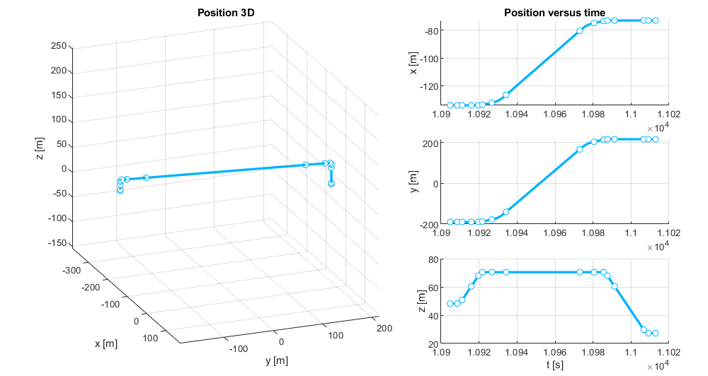

# 05: Generation of a fleet of autonomous drones operating in the city

## Gazebo

First, we open a scenario in the Gazebo simulator (in the same computer or other computer connected to the same subnetwotk):

```bash
cd
cd code/navsim/ws/src/navsim_pkg/worlds
gazebo generated_city.world
```

Gazebo shows a small city of 500x500 meters in which blocks represent buildings.
You can zoom out to observe the whole city.


As in the previous tutorials, in a new terminal, verify that the ROS2 **/World** node is running a service **/NavSim/DeployModel** for deploying objects in the area:

```bash
ros2 node list
ros2 service list | grep Deploy
```

## Matlab

### Running the simulation

Now open Matlab (in the same computer or other computer connected to the same subnetwotk).
Navigate to `navsim/matlab/simulations/tutos/tuto5`. From here, open the script `simulation.m` and execute it.

>We are experiencing issues with accessing ROS2 communications from Matlab on Ubuntu platforms. Therefore, we recommend running the Matlab portion of this tutorial from a Windows system connected via the network to the Ubuntu system running the Gazebo simulator.

This code employs a **SimpleBuilder** to deploy vertiports in the area, a **USpaceOperator** to manage the operation of several drones, and a **SimpleMonitor** to analyze their accuracy executing flight plans.

> In some parts of the code, pauses are incorporated with the `pause( )` command.
> This is done to allow time for ROS2 nodes to wake up and handle pending requests before continuing with the program.

```matlab
builder  = SimpleBuilder ('builder' ,NAVSIM_MODELS_PATH);
operator = USpaceOperator('operator',NAVSIM_MODELS_PATH);
monitor  = SimpleMonitor('monitor');
```

First, we place a set of vertiports on the rooftops of several buildings. This time, we inform the operator about the existence of these vertiports.

```matlab
% -------------
% Set vertiports

%               x        y        z       rz
portsLoc = [ -190.00  -119.00  +048.00    pi/4
             -152.00  -106.00  +049.00    pi/4
             -134.00  -190.00  +048.00    00
             -092.00  -144.00  +041.00    00
             -074.00  -100.00  +043.00    00
             -073.00  +216.00  +027.00    00
             -007.00  +015.00  +043.00    00
             +060.00  +131.00  +032.00    00
             +180.00  +033.00  +050.00    00
             +186.00  -081.00  +050.00    pi/2
             -200.00  +157.00  +044.00    pi/2
             -200.00   +20.00  +042.00    pi/2
             +186.00  +195.00  +039.00    pi/2
             +126.00  -189.00  +039.00    pi/2
           ];


for i = 1:size(portsLoc,1)
   
    id = sprintf('BASE%02d', i);
    builder.DeployModel('UAM/vertiport_H', id, ...
        portsLoc(i,1:3), ...
        [0 0 portsLoc(i,4)]);
    operator.SetVertiport(id,portsLoc(i,1:3),1);
end
```

In the image, we can appreciate (with some difficulty due to the distance) blue circles on the rooftops of various buildings.


Next, we configure the aircraft performance
and ask the **operator** to deploy a certain number of drones for us.
Only one drone is allowed at each vertiport.
This time, we will deploy as many drones as possible, not exceeding the number of available vertiports.

```matlab
% -------------
% Deploy fleet
info = UAVinfo('',UAVmodels.MiniDroneFP1);
info.velMax = 10;
operator.DeployFleet(size(portsLoc,1),info);
```


And finally, for each drone, we instruct the **monitor** to store the telemetry information transmitted, and the operator to generate an initial operation:

```matlab
% -------------
% Begin operations
for UAVid = operator.FleetIds
    monitor.TrackUAV(UAVid); 
    operator.OperateUAV(UAVid);
end
```
Each operation starts from the vertiport where the drone is located, towards a randomly chosen destination vertiport (with the only restriction being that it must be different from the origin). The flight plan includes the drone ascending to a height of 70 meters (plus or minus 9 meters, depending on the course to follow), flying straight towards its destination, and descending vertically to land. The ascent and descent are performed at 2m/s. The cruising speed is 10m/s. 10 meters before completing the horizontal displacement, the drone reduces its speed to 2 m/s.




As soon as a drone informs the operator that it has completed the flight plan, the operator will assign it a new operation that will start 10 seconds later.
The following figure shows more than 8000 telemetry data from UAV01, collected by the monitoring service during 2 hours and 15 minutes of simulation.


### Considerations about flight plan conflict detection and aircraft collision avoidance

It is important to note that this operator does not check if the proposed flight plan conflicts with another previously existing plan. Because the cruising altitude varies depending on the course, it is unlikely (though not impossible) that two aircraft will collide during their horizontal displacement. 
However, it is highly probable that multiple aircraft will coincide in the vertical segment of the maneuver, either during takeoff or landing.


These drones will collide in the air, damaging both aircraft and their cargo, posing a serious danger to the surroundings.


