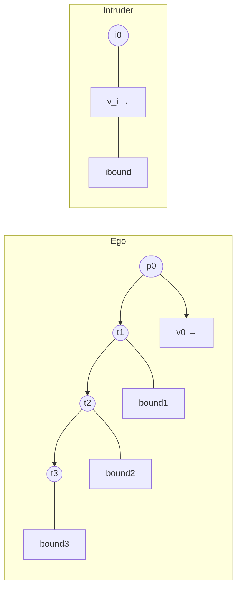

# Kinematic Bounding — Visualization and Explanation

This document provides a clear, academic, and professional English description and visualization of kinematic bounding for use in Chapter 4 (Design and Architecture) of the TFG. It includes formal definitions, compact equations (KaTeX), a simple diagram suggestion, and practical notes for rendering the figure.

**Abstract**
- **Purpose:** Describe the `kinematic bounding` concept used to approximate the reachable space of an unmanned aerial vehicle (UAV) over a short time horizon for conflict detection and resolution.
- **Audience:** Academic readers and thesis examiners.

**Core Concept**
- **Definition:** Kinematic bounding constructs a conservative geometric approximation of the set of positions a vehicle can occupy over a time horizon $T$ given limits on its velocity and acceleration. The result is a time-indexed bounding volume (swept volume) used in collision checking and conflict resolution.

**Mathematical formulation**
- Let `p(t)` denote the 2D or 3D position of the UAV at time $t$, `v(t)` its velocity, and assume bounded acceleration with $\|a(t)\| \le A_{max}$ and bounded speed $\|v(t)\| \le V_{max}$.

- For short horizons with constant-bounded acceleration, a conservative reachable set at horizon $T$ can be approximated by

$$
R(T) = \{ p_0 + v_0 t + \tfrac{1}{2} a t^2 \;\mid\; t \in [0,T],\; \|a\| \le A_{max} \},
$$

where `p_0` and `v_0` are the current position and velocity.

- Equivalently, the continuous swept volume over the interval can be over-approximated by the Minkowski sum of the nominal trajectory and a radial growth term capturing acceleration uncertainty:

$$
\text{SweptVolume}(T) \approx \{\gamma(t)\;:\; t\in[0,T]\} \oplus B(0, \tfrac{1}{2}A_{max} t^2),
$$

where $\gamma(t)=p_0+v_0 t$ and $B(0,r)$ is the ball of radius $r$ (in 2D/3D). For bounded speed only, use $B(0,V_{err}(t))$ where $V_{err}$ is a chosen uncertainty radius.

**Discrete construction used in implementation**
- **Time discretization:** partition $[0,T]$ into $N$ intervals of width $\Delta t = T/N$.
- **Per-step bounding box:** at each step $k$ evaluate the nominal point `p_k = p_0 + v_0 k\Delta t` and grow an oriented bounding box (OBB) or disc/sphere by radius $r_k = \tfrac{1}{2}A_{max} (k\Delta t)^2`.
- **Union:** the kinematic bound is the union of these per-step volumes. In practice this union is simplified into a single swept OBB or a small set of overlapping OBBs for efficiency.

**Algorithm (concise)**
1. Input: `p_0`, `v_0`, horizon `T`, acceleration bound `A_max`, discretization `N`.
2. For k = 0..N: compute `t_k = k * Delta t`, `p_k = p_0 + v_0 * t_k`, `r_k = 0.5 * A_max * t_k^2`.
3. Create an OBB or disc centered on `p_k` oriented by `v_0` with half-axes `(length=V_max*Delta t/2 + margin, width=r_k)`.
4. Merge or keep the sequence as the swept bound.

**Figure suggestion (visual components)**
- Ego vehicle trajectory (solid blue line) starting at `p_0` with velocity vector `v_0` (arrow).
- Discrete time samples shown as points along the trajectory (small dots).
- Per-sample bounding discs/OBBs (semi-transparent red) whose radius/width grows with time.
- Overall swept volume (transparent red surface) as the union/convex hull of the per-sample bounds.
- Intruder vehicle (dashed black) and its own kinematic bound (semi-transparent orange) for comparison.
- Safety margin (thin dashed line) around volumes, annotated with the chosen separation distance $d_{sep}$.

**Mermaid sketch (for quick visualization)**

Note: the Mermaid sketch is schematic; for thesis figures prefer vector graphics (Inkscape, Adobe Illustrator) or programmatic plotting (Matplotlib with transparency) to clearly render OBBs and swept volumes.

**Caption (suggested text for a thesis figure)**
- Figure X — Kinematic bounding for conflict detection: the ego UAV nominal trajectory is shown in blue with discrete time samples. Semi-transparent red shapes indicate the per-step kinematic bounds that account for bounded acceleration; their union yields a conservative swept volume used for collision checking. The intruder (dashed black) and its kinematic bound are shown for comparison.

**Notes on presentation and reproducibility**
- Use consistent color palette with high contrast (blue ego, orange intruder, red bounds).
- Present both 2D top-down and 3D perspective views if space allows.
- Provide parameter values in a table near the figure: `T`, `N`, `A_max`, `V_max`, `d_sep`.
- Include the equations and a short paragraph explaining discretization and approximation error (e.g., how $\Delta t$ affects conservativeness).

**Rendering tips (Matplotlib)**
- Use `alpha` for transparency (e.g., `alpha=0.25`) for bounds.
- Draw OBBs by rotating rectangles using the orientation of `v_0` and scaling widths by `r_k`.
- Optionally compute convex hull of sample-ellipse boundaries for a single swept polygon and fill it.

---

If you want, I can (choose one):
- generate a Matplotlib script that draws the figure with adjustable parameters;
- produce a high-resolution SVG diagram ready for inclusion in LaTeX;
- or refine the written paragraph to match the exact notation of Chapter 4.

File created: [uspace/uav_conflict_resolver/visualizers/kinematic_bounding_visualization.md](uspace/uav_conflict_resolver/visualizers/kinematic_bounding_visualization.md)
